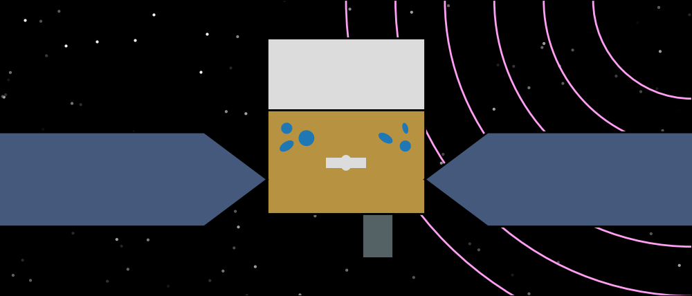

.. _gdt-fermi:

****************************************************
Welcome to Fermi Gamma-ray Data Tools Documentation!
****************************************************

The Fermi Gamma-ray Data Tools (GDT) is a toolkit for Fermi data built on the 
:external:ref:`GDT Core Package<gdt-core>` and is the next iteration of the 
`Fermi GBM Data Tools <https://fermi.gsfc.nasa.gov/ssc/data/analysis/gbm/gbm_data_tools/gdt-docs>`_. 

The Fermi Gamma-ray Space Telescope was launched on June 11, 2008 and contains
two intruments: the Large Area Telescope (LAT) surveying the sky in the 
~20 MeV--300 GeV energy range, and the Gamma-ray Burst Monitor (GBM) observing 
the full unocculted sky with 14 individual detectors from ~8 keV--40 MeV. 
Currently the toolkit services all Fermi GBM public data, and a future version
will incorporate support for some Fermi LAT data.

.. rubric:: Citing

If you use the Fermi Gamma-ray Data Tools in your research and publications, 
we would definitely appreciate an appropriate acknowledgment and citation! We 
suggest the following BibTex:

::

 @misc{GDT-Fermi,
       author = {Adam Goldstein and William H. Cleveland and Daniel Kocevski},
       title = {Fermi Gamma-ray Data Tools: v2.0.0},
       year = 2023,
       url = {https://github.com/USRA-STI/gdt-fermi}
 }
 

.. rubric:: Additional Resources
 
The Fermi Science Support Center is a fantastic resource for all things Fermi.
Specifically, for GBM, a lot of useful information about the data products can 
be found `here <https://fermi.gsfc.nasa.gov/ssc/data/access/gbm/>`_.  For 
questions, bug reports, and comments, please visit the 
`Fermi Help Desk <https://fermi.gsfc.nasa.gov/ssc/help/>`_.

.. rubric:: Acknowledgments

The Fermi Gamma-ray Data Tools were partially funded by the Fermi Guest Investigator 
program (NNH18ZDA001N) and by Cooperative Agreement 80MSFC17M0022.

***************
Getting Started
***************
.. toctree::
   :maxdepth: 1

   install

******************
User Documentation
******************

Fermi Definitions
=================
.. toctree::
   :maxdepth: 1

   missions/fermi/time
   missions/fermi/frame
   missions/fermi/mcilwainl
   missions/fermi/plot

Fermi GBM
=========

Instrument Definitions
----------------------

.. toctree::
   :maxdepth: 1

   missions/fermi/gbm/detectors
   missions/fermi/gbm/collection
   missions/fermi/gbm/saa
   missions/fermi/gbm/headers

Data Types
----------

.. toctree::
   :maxdepth: 1

   missions/fermi/gbm/phaii
   missions/fermi/gbm/tte
   missions/fermi/gbm/response
   missions/fermi/gbm/localization
   missions/fermi/gbm/trigdat
   missions/fermi/gbm/poshist
   missions/fermi/gbm/scat
   missions/fermi/gbm/tcat

Data Finders and Catalogs
-------------------------

.. toctree::
   :maxdepth: 1

   missions/fermi/gbm/finders
   missions/fermi/gbm/catalogs

----

*******
License
*******
.. toctree::
   :maxdepth: 1
   
   license

Indices and tables
==================

* :ref:`genindex`
* :ref:`modindex`
* :ref:`search`
