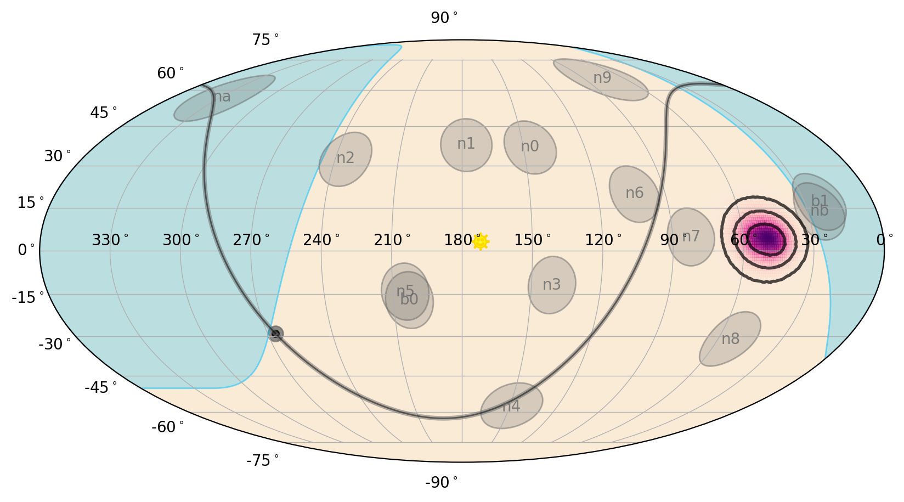

.. _gbm-localization:
.. |GbmHealPix| replace:: :class:`~gdt.missions.fermi.gbm.localization.GbmHealPix`
.. |region_probability()| replace:: :meth:`~gdt.missions.fermi.gbm.localization.GbmHealPix.region_probability`

********************************************************************
Fermi GBM Localizations (:mod:`gdt.missions.fermi.gbm.localization`)
********************************************************************

As part of mission operations, GBM produces localizations for GRBs and 
disseminates these to the community. GCN notices are sent to interested 
follow-up observers containing brief summary information, and HEALPix FITS 
files containing the localization are created and hosted at the Fermi Science 
Support Center. These localizations contain the best-modeled systematic 
uncertainty in the localization and contain a host of metadata such as the 
individual detector pointings and the geocenter location as observed by Fermi.

We can read one of these HEALPix files using the |GbmHealPix| class:

    >>> from gdt import test_data
    >>> from gdt.missions.fermi.gbm.localization import GbmHealPix
    >>> filepath = test_data['fermi-gbm'].joinpath('glg_healpix_all_bn190915240_v00.fit')
    >>> loc = GbmHealPix.open(filepath)
    >>> loc
    <GbmHealPix: glg_healpix_all_bn190915240_v00.fit
     NSIDE=128; trigtime=590219102.911008;
     centroid=(48.8671875, 4.181528273111476)>

We can easily access some of the HEALPix-specific info (see also 
:external:ref:`The HealPix Module<core-healpix>` for more details):
    
    >>> loc.nside
    128
    >>> loc.npix
    196608
    >>> loc.pixel_area # (in sq. deg.)
    0.20982341130279172

As for the localization information, we can retrieve the sky position with the 
highest probability (centroid):

    >>> loc.centroid
    (48.8671875, 4.181528273111476)

Or we can determine the probability of the localization at a particular point 
in the sky:

    >>> loc.probability(49.0, 4.0)
    0.009200396515918592
    
And if we want to determine the confidence level a particular point on the sky 
is relative to the localization:

    >>> loc.confidence(40.0, 4.0)
    0.865783539232832

Often for follow-up observations, it's useful to know how much sky area the 
localization covers at a some confidence level:
    
    >>> loc.area(0.9) # 90% confidence in units of sq. degrees
    281.1633711457409

And for plotting or other purposes, we can retrieve the RA and Dec "paths" for 
a given confidence region.

.. Note::
    A confidence region may have many disjoint pieces, so this will be a list of 
    arrays

    >>> loc.confidence_region_path(0.5)
    [array([[ 4.61281337e+01,  2.59721684e-01],
            [ 4.53138456e+01,  5.02793296e-01],
            [ 4.51253482e+01,  6.21222158e-01],
            ...
            [ 4.71309192e+01,  7.52679010e-02],
            [ 4.61281337e+01,  2.59721684e-01]])]

We can even determine the probability that a point source at a given location 
is association with the skymap (as opposed to the null hypothesis of two 
spatially-unrelated sources):

    >>> loc.source_probability(50.0, 10.0)
    0.9873891240856155
    >>> loc.source_probability(150.0, 10.0)
    4.406012895262377e-15

For extend sky regions, the |region_probability()| method should be used with 
another HEALPix object to return the probability that the two maps are spatially 
associated.

We can retrieve, as attributes, various other interesting tidbits:
   
    >>> # sun location
    >>> loc.sun_location.ra, loc.sun_location.dec
    (<Longitude 172.50119354 deg>, <Latitude 3.23797214 deg>)
    
    >>> # geocenter location
    >>> loc.geo_location.ra, loc.geo_location.dec
    (<Longitude 319.83123902 deg>, <Latitude 17.40612935 deg>)
    
    >>> # geocenter radius
    >>> loc.geo_radius
    <Quantity 67.30651147 deg>
    
    >>> # detector n0 pointing
    >>>  loc.n0_pointing.ra, loc.n0_pointing.dec
    (<Longitude 146.59008064 deg>, <Latitude 36.96803363 deg>)
    
    >>> # Fraction of localization on Earth
    >>> loc.geo_probability
    8.476746e-06

Of course, since we have a HEALPix file, we can make a pretty sky map!

    >>> import matplotlib.pyplot as plt
    >>> from gdt.plot.sky import EquatorialPlot
    >>> # initialize
    >>> skyplot = EquatorialPlot()
    >>> # add our HEALPix localization
    >>> skyplot.add_localization(loc)
    >>> plt.show()
    

By default, the plot shows the localization (purple gradient and black contours),
the Earth occultation region (blue), the detector pointings (grey circles), 
Galactic Plane (gray/black line), and sun (yellow smiley-face).

This is for default plotting options, but you can do a lot of customization on 
what is plotted (see :external:ref:`Plotting Sky Maps, Localizations, and 
Wide-field Effective Area<plot-sky>` for more details).

Reference/API
=============

.. automodapi:: gdt.missions.fermi.gbm.localization
   :inherited-members:

