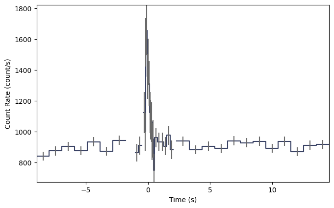
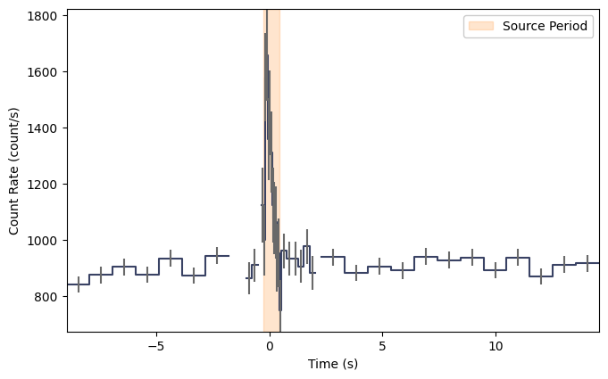
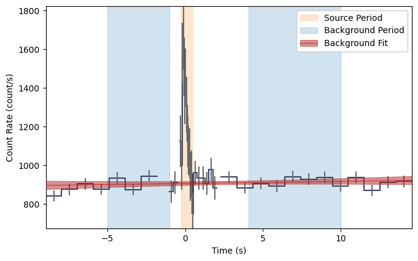
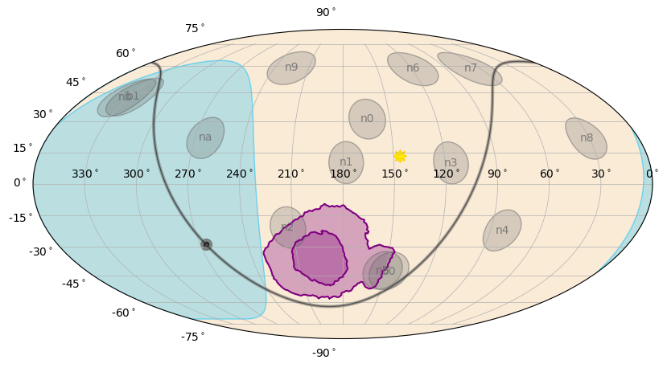
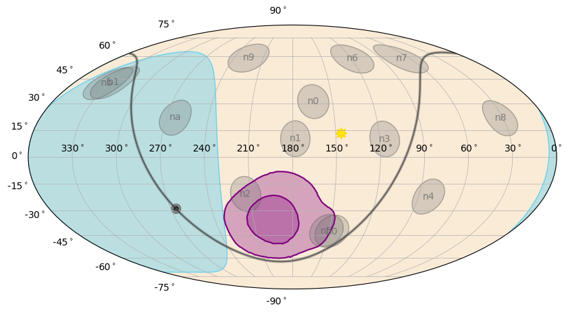

.. _dol:

**************************************************************************************
Fermi GBM Localizations using the DoL
**************************************************************************************
(:mod:`gdt.missions.fermi.gbm.localization.dol`)

The ``dol`` provides modules capable of creating the same legacy ground localizations
that are produced by the GBM Science Team. These python modules exactly
replicate the operations of the original Fortran code.

The package is divided into the following modules:

.. toctree::
   :maxdepth: 1

   legacy_dol
   legacy_functions
   legacy_spectral_models

Users can check the links above for additional information on the subroutines of each module.
The remainder of this page will focus on creating an example ground localization for GRB 170817A.

Preparing Data for a Localization
========================================
The first step to creating a ground localization is obtaining data near the time of a burst.
For simplicity, we will work with a :class:`~gdt.missions.fermi.gbm.trigdat.Trigdat` file in this example because
it conventiently contains binned data for all detectors as well as position history information
about the spacecraft. However, any :class:`~gdt.missions.fermi.gbm.phaii.GbmPhaii` formatted data
and :class:`~gdt.missions.fermi.gbm.poshist.GbmPosHist` combination will work as long as the data
are binned into the same energy bins as the :class:`~gdt.missions.fermi.gbm.trigdat.Trigdat` files.

We begin data preparation by downloading the trigdat file ``glg_trigdat_all_bn170817529_v01.fit`` to our local 
directory using the :class:`~gdt.missions.fermi.gbm.finders.TriggerFinder` class initialized with
GBM burst number 170817529, which corresponds to GRB 170817A.

    >>> from gdt.missions.fermi.gbm.finders import TriggerFinder
    >>> finder = TriggerFinder("170817529")
    >>> finder.get_trigdat(".")

Next we open the ``glg_trigdat_all_bn170817529_v01.fit`` file using the :class:`~gdt.missions.fermi.gbm.trigdat.Trigdat` class

    >>> from gdt.missions.fermi.gbm.trigdat import Trigdat
    >>> trigdat = Trigdat.open("glg_trigdat_all_bn170817529_v01.fit")

We then plot a summed lightcurve for all detectors identified as contributing
to the creation of this trigger. This is done over the 50-300 keV energy
range near the time of the trigger. We specify a minimum binning timescale of
64 milliseconds when creating this lightcurve because we are examining a
known short GRB. Longer binnings are more appropriate for long GRBs.

    >>> from gdt.core.plot.lightcurve import Lightcurve
    >>> loc_erange = (50.0, 300.0)
    >>> trigdet = trigdat.triggered_detectors
    >>> summed_phaii = trigdat.sum_detectors(trigdet, timescale=64)
    >>> summed_phaii = summed_phaii.slice_energy(loc_erange)
    >>> summed_phaii = summed_phaii.slice_time((-8, 14))
    >>> lcplot1 = Lightcurve(summed_phaii.to_lightcurve())

Upon visual inspection, we see that the GRB appears in the lightcurve as a single pulse
from approximately -0.256 s to +0.448 s around the trigger time. This will be our 
source window that we use to compute the observed counts in each detector while the
GRB is active. We will now retrieve the observed counts in this window while also
creating a new lightcurve with the source period highlighted.

    >>> import numpy as np
    >>> import matplotlib.pyplot as plt
    >>> src_time = (-0.256, 0.448)
    >>> src_counts = []
    >>> src_exposure = []
    >>> for det in trigdat._detectors:
    ...    phaii = trigdat.to_phaii(det, timescale=64)
    ...    bin = phaii.data.integrate_time(*src_time)
    ...    src_counts.append(bin.counts.astype(np.int32))
    ...    src_exposure.append(bin.exposure)
    ...    print(f" - {det} {src_counts[-1]}")
     - n0 [ 48 267 176 127 135  25  18  77]
     - n1 [ 50 301 188 153 155  27  30  66]
     - n2 [ 55 285 190 162 141  31  54  33]
     - n3 [ 64 316 171 131 126  32  22  55]
     - n4 [ 51 293 188 147 113  26  52  27]
     - n5 [ 65 367 217 177 149  30  46  23]
     - n6 [ 54 217 135 114 103  23  53  18]
     - n7 [ 70 275 182 135 107  22  26  58]
     - n8 [ 59 252 155 121 116  21  43  32]
     - n9 [ 48 179 152 115 116  30  82  13]
     - na [ 34  89 110 146 104  25  59  27]
     - nb [ 33 120 101 155 122  44  29  74]
     - b0 [374 204 318 128  26  10  15  95]
     - b1 [358 219 258 103  37  26  15  85]
    >>> avg_src_exposure = np.sum(src_exposure) / np.array(src_exposure).size
    >>> print(" Exposure %.3f sec" % avg_src_exposure)
     Exposure 0.768 sec
    >>> lcplot2 = Lightcurve(summed_phaii.to_lightcurve())
    >>> ax = plt.gca()
    >>> src_span = ax.axvspan(*src_time, color='C1', alpha=0.2)
    >>> l2 = plt.legend([src_span], ["Source Period"], framealpha=1.0,)

Note that each detector has a set of eight counts values, corresponding
to the eight energy bins in the :class:`~gdt.missions.fermi.gbm.trigdat.Trigdat` file.

.. _dol-example-background:

Next we will need an estimate for the background counts within the source window.
Since the background is fairly linear at times outside our window,
we use a first order polynomial fit to estimate the background.
We perform the fit on two background periods, one
just before and one just after the source window:

    >>> from gdt.core.background.fitter import BackgroundFitter
    >>> from gdt.core.background.binned import Polynomial
    >>> bg_times = [(-5, -1), (4.096, 10)]
    >>> bg_counts = []
    >>> bg_exposure = []
    >>> bg_trigdet = []
    >>> for det in trigdat._detectors:
    ...     phaii = trigdat.to_phaii(det, timescale=64)
    ...     fitter = BackgroundFitter.from_phaii(phaii, Polynomial, time_ranges=bg_times)
    ...     fitter.fit(order=1)
    ...     bg_rates = fitter.interpolate_bins(phaii.data.tstart, phaii.data.tstop)
    ...     bin = bg_rates.integrate_time(*src_time)
    ...     bg_counts.append(bin.counts.astype(np.int32))
    ...     bg_exposure.append(bin.exposure)
    ...     print(f" - {det} {bg_counts[-1]}")
    ...     if det in trigdet:
    ...         bg_trigdet.append(bg_rates.slice_energy(*loc_erange))
     - n0 [ 50 237 156 121 111  32  22  66]
     - n1 [ 50 257 167 124 103  25  32  59]
     - n2 [ 51 235 159 114 114  29  51  36]
     - n3 [ 64 303 186 128 103  23  17  52]
     - n4 [ 56 305 196 123 104  24  37  32]
     - n5 [ 65 299 190 123 115  28  48  24]
     - n6 [ 50 221 140 108 105  24  55  15]
     - n7 [ 62 269 172 123 101  25  29  42]
     - n8 [ 51 253 159 115 104  28  44  38]
     - n9 [ 40 199 142 123 110  27  77  13]
     - na [ 46  97 115 111 106  27  61  28]
     - nb [ 26 121 112 104 117  31  26  60]
     - b0 [368 220 265 117  25  17  17  86]
     - b1 [303 243 259 103  25  21  16  85]
    >>> avg_bg_exposure = np.sum(bg_exposure) / np.array(bg_exposure).size
    >>> print(" Exposure %.3f sec" % avg_bg_exposure)
     Exposure 0.768 sec
    >>> bg_trigdet_sum = bg_trigdet[0].sum_time(bg_trigdet)
    >>> lcplot3 = Lightcurve(summed_phaii.to_lightcurve())
    >>> ax = plt.gca()
    >>> src_span = ax.axvspan(*src_time, color='C1', alpha=0.2)
    >>> bg_span = ax.axvspan(*bg_times[0], color='C0', alpha=0.2)
    >>> ax.axvspan(*bg_times[1], color='C0', alpha=0.2)
    >>> lcplot3.set_background(bg_trigdet_sum)
    >>> l3 = plt.legend([src_span, bg_span, tuple(lcplot._bkgd._artists)], 
    ...                 ["Source Period", "Background Period", "Background Fit"], framealpha=1.0,)

We now have arrays with the measured source counts ``src_counts`` and estimated background counts ``bg_counts``
needed to perform a localization. However, we need to specify the energy range covered by the PHAII bins
and determine which bins correspond to the 50-300 keV range needed for the localization.

    >>> energies = np.concatenate([phaii.data.emin, [phaii.data.emax[-1]]])
    >>> loc_erange = (50.0, 300.0)
    >>> crange = [np.digitize(e, energies, right=True) - 1 for e in loc_erange]

We also need the position and rotation of the spacecraft to determine the conversion between
the spacecraft coordinates, where the localization calculation is performed, and Equatorial
coordinates.

    >>> from gdt.missions.fermi.time import Time
    >>> tcenter = trigdat.trigtime + 0.5 * sum(src_time)
    >>> frame = trigdat.poshist.at(Time(tcenter, format='fermi'))
    >>> scpos = frame.obsgeoloc.xyz.to_value('km') # spacecraft position in km to Earth center
    >>> quaternion = frame.quaternion.scalar_last # spacecraft rotation

Note that this is done using the central time of the source window. It does not account for
spacecraft motion so you should limit the source window length to less than ~1 min, even for long GRBs.
It is recommended to fit the brightest peak when using the DoL algorithm to localize GRBs
with durations longer than 1 minute.

Lastly, we'll gather information about the final flight software localization from the triggered
data header. This is only used to compare against the DoL computed best-fit location so you
can assign other ra, dec values if you so choose.

    >>> ra = trigdat.headers['PRIMARY']['RA_OBJ']
    >>> dec = trigdat.headers['PRIMARY']['DEC_OBJ']

Creating Your Own Ground Localization
=====================================
If you followed the data preparation section you should now have the following 
variables defined:

* ``src_counts`` list containing the observed counts during the source window for all GBM detectors. The shape is (14, 8) since there are 14 detectors, each with 8 energy bins.
* ``avg_src_exposure`` average exposure in seconds across the source window for all GBM detectors. 
* ``bg_counts`` list containing the estimated background counts during the source window for all GBM detectors. The shape is (14, 8) since there are 14 detectors, each with 8 energy bins.
* ``avg_bg_exposure`` average exposure in seconds for the background estimate across the source window for all GBM detectors. 
* ``crange`` list with the energy bin range corresponding to 50-300 keV
* ``scpos`` list with spacecraft position relative to Earth center in km
* ``quaternion`` list with spacecraft rotation information. Format is scalar last.
* ``energies`` energy bin edges in keV
* ``ra`` initial guess for source right ascension in degrees
* ``dec`` initial guess for source declination in degrees
* ``tcenter`` central time of the source window in Fermi mission elapsed seconds (MET)
* ``frame`` object defining the spacecraft state at ``tcenter``

You are now ready to perform the ground localization. Do this with

    >>> from gdt.missions.fermi.gbm.localization.dol.legacy_dol import legacy_DoL
    >>> dol = legacy_DoL()
    >>> loc = dol.eval(crange, np.array(src_counts), np.array(bg_counts),
    ...                avg_src_exposure, avg_bg_exposure,
    ...                scpos, quaternion, energies, ra, dec, int(tcenter),
    ...                scat_opt=1)

The ``eval()`` method will take a few seconds to complete before returning the localization result
as a dictionary object. The best-fit position in Equatorial coordinates with units of degrees can be 
obtained with

    >>> np.degrees([loc["best"]["ra"], loc["best"]["dec"])
    array([191.23910266, -38.14466349])

The azimuth and zenith of this position in spacecraft coordinates with units of degrees can be returned with 

    >>> np.degrees([loc["best"]["az"], loc["best"]["zen"]])
    array([33.00000096, 94.00000018])

Finally, the approximate 68% containment radius in degrees is

    >>> loc["best"]["err"]
    16.240667

These values are calculated from a chi-square fit statistic computed on a 1 degree sky grid in spacecraft coordinates.
The full set of chi-square values are available with

    >>> loc["best"]["chi2"]
    [40.354504 37.616688 39.927006 ... 37.869972 37.898384 37.692604]

However, it is better to convert these values to a healpix-formatted probability map stored as a :class:`~gdt.missions.fermi.gbm.localization.GbmHealPix` object with

    >>> healpix = dol.to_GbmHealPix(loc, frame)

This map can be plotted with

    >>> from gdt.core.plot.sky import EquatorialPlot
    >>> skyplot1 = EquatorialPlot()
    >>> skyplot1.add_localization(healpix, clevels=[0.90, 0.50], gradient=False)

where the purple contours mark the 90% and 50% containment areas defined by the statistical uncertainty
of the observed counts. We can apply the systematic uncertainty defined for human-in-the-loop
(HITL) ground localizations by convolving the statistical map with :meth:`~gdt.missions.fermi.gbm.localization.hitl_model`.
This method applies a core + tail model with two Gaussian smoothings whose widths are determined by the best-fit azimuth value in degrees.
See [1]_ for more details on the derivation of this systematic.

    >>> from gdt.missions.fermi.gbm.localization import hitl_model
    >>> az = np.degrees(loc["best"]["az"])
    >>> healpix = healpix.convolve(hitl_model, az, quaternion=healpix.quaternion, scpos=healpix.scpos)

As a final step before plotting, we remove the Earth region from the probability map because gamma-ray sources
cannot penetrate the Earth. This must be done after convolution with the systematic model to
avoid smearing the region blocked by the Earth into visible parts of the sky.

    >>> healpix = healpix.remove_earth()
    >>> skyplot2 = EquatorialPlot()
    >>> skyplot2.add_localization(healpix, clevels=[0.90, 0.50], gradient=False)

Note About Localizing Non-GRB Transients
========================================

Transients with softer spectra than GRBs, such as Soft Gamma-ray Repeaters (SGRs) and
Solar Flares, typically benefit from localizations performed over a 5-50 keV
energy range instead of the default 50-300 keV range. This can be done by using
the 5-50 keV response file prepared only for the default soft spectrum.

    >>> from gdt.missions.fermi.gbm.localization.dol import legacy_spectral_models
    >>> spec = [("Soft_5_50:", legacy_spectral_models.band_soft)]
    >>> rsp_files = [legacy_spectral_models.band_soft_5_50]
    >>> from gdt.missions.fermi.gbm.localization.dol.legacy_dol import legacy_DoL
    >>> dol = legacy_DoL(spec=spec, locrates=rsp_files)

The user will also need to provide detector counts to the :meth:`~gdt.missions.fermi.gbm.localization.dol.legacy_dol.legacy_DoL.eval` method calculated over the 5-50 keV energy range, typically given as energy bin indices [1, 2] for :class:`~gdt.missions.fermi.gbm.trigdat.Trigdat` files to avoid background
instabilities in the lowest energy bin (index 0).

References:
"""""""""""

.. [1] `Connaughton, V. et al. 2015, ApJ, 216, 32 <https://iopscience.iop.org/article/10.1088/0067-0049/216/2/32>`_
