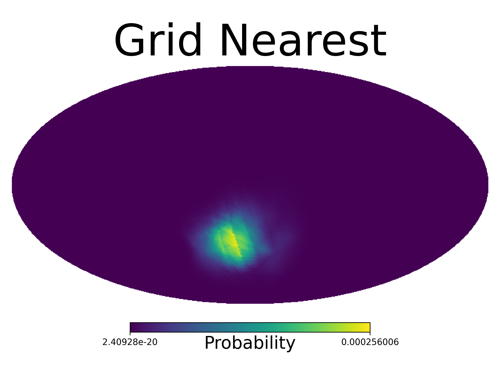
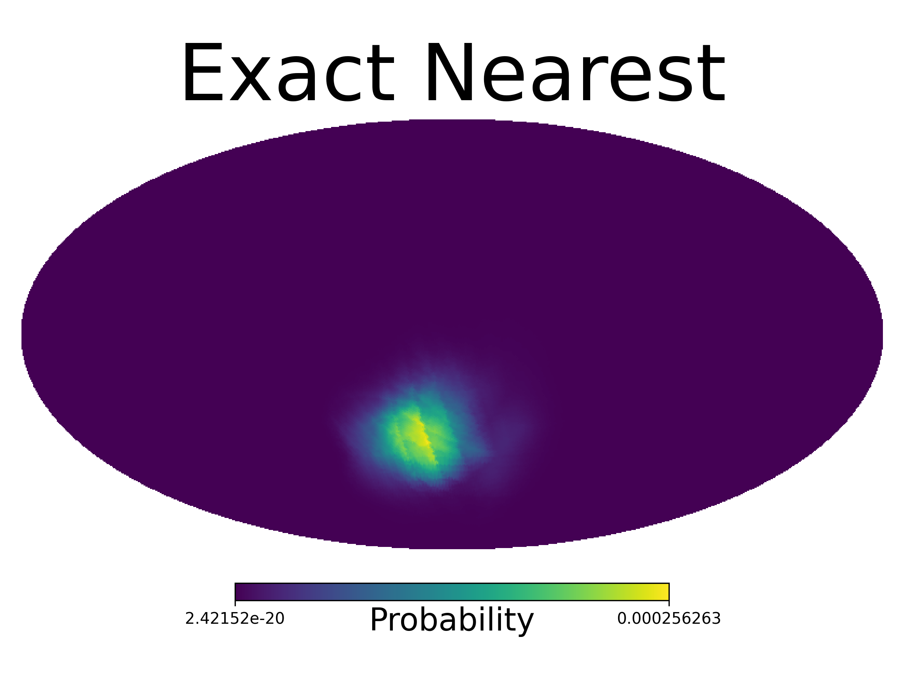
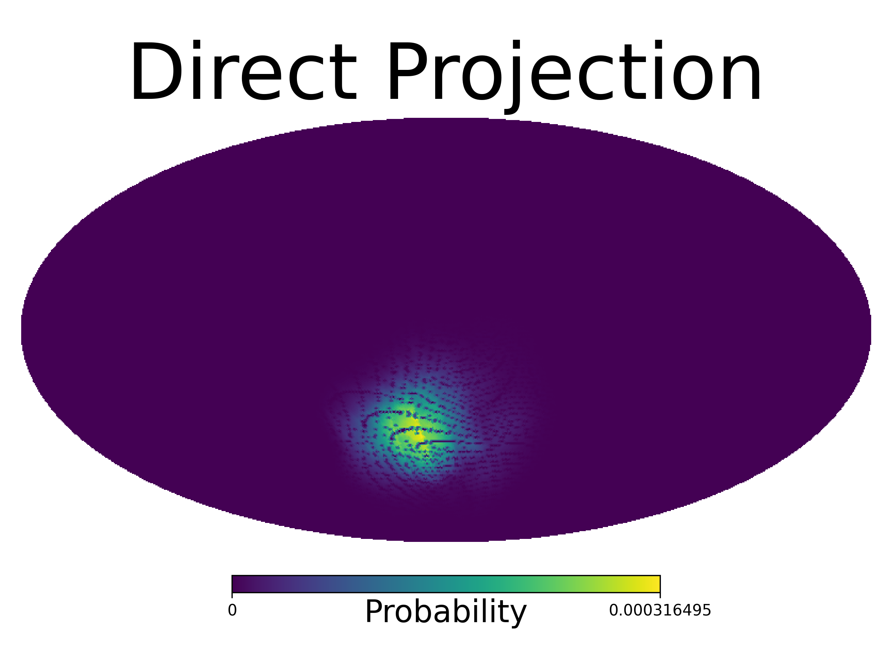

.. _gbm-dol-legacy:

*********************************************************************************************
Legacy DoL Class and Command Line Interface
*********************************************************************************************
(:mod:`gdt.missions.fermi.gbm.localization.dol.legacy_dol`)

This module provides a high level implementation of the DoL algorithm. It contains
the :class:`~gdt.missions.fermi.gbm.localization.dol.legacy_dol.legacy_DoL` class that 
initializes detector response grids in memory, evaluates the localization method over
input data, and returns the best-fit result as a dictionary object. This class is
typically instanced with

    >>> from gdt.missions.fermi.gbm.localization.dol.legacy_dol import legacy_DoL
    >>> dol = legacy_DoL()

The default behavior of the class is to perform a localization with three spectral
templates that describe GRB emission from 50-300 keV. These spectra are modeled
using a Band function [1]_ with the parameters shown in Table 1.
A :math:`\chi^2` minimization is performed separately for each spectrum with the
best-fit location and spectrum chosen from the lowest :math:`\chi^2`
among the three minima. See the core :ref:`Legacy DoL Functions<gbm-dol-legacy-functions>`
for a description of the :math:`\chi^2` minimization process.

.. list-table:: Table 1. Default Spectral Templates (Band)
   :widths: 25 25 25 25
   :header-rows: 1

   * - Name
     - :math:`\alpha`
     - :math:`\beta`
     - :math:`E_{peak}` [keV]
   * - Hard
     - 0.0
     - -1.5
     - 1000.0
   * - Normal
     - -1.0
     - -2.3
     - 230.0
   * - Soft
     - -2.0
     - -3.4
     - 70.0

Alternatively, users can choose from three additional spectral templates that are defined by a cutoff power law
following the parameters shown in Table 2.

.. list-table:: Table 2. Additional Spectral Templates (Cutoff Power Law)
   :widths: 25 25 25
   :header-rows: 1

   * - Name
     - :math:`\alpha`
     - :math:`E_{peak}` [keV]
   * - Hard
     - -0.25
     - 1000.0
   * - Normal
     - -1.15
     - 350.0
   * - Soft
     - -1.95
     - 50.0

These can be supplied using the definitions from :mod:`~gdt.missions.fermi.gbm.localization.dol.legacy_spectral_models`
when initializing the class

    >>> from gdt.missions.fermi.gbm.localization.dol import legacy_spectral_models
    >>> spec = [("Hard", legacy_spectral_models.comp_hard),
    ...         ("Normal", legacy_spectral_models.comp_norm),
    ...         ("Soft", legacy_spectral_models.comp_soft)]
    >>> rsp_files = [legacy_spectral_models.comp_hard_50_300,
    ...              legacy_spectral_models.comp_norm_50_300,
    ...              legacy_spectral_models.comp_soft_50_300]
    >>> from gdt.missions.fermi.gbm.localization.dol.legacy_dol import legacy_DoL
    >>> dol = legacy_DoL(spec=spec, locrates=rsp_files)

Note that a corresponding response file must be specified for each spectrum. This defines the 
direct detector response to the provided spectrum. The :ref:`Legacy DoL Spectral Functions<gbm-dol-legacy-spectral-models>` page
provides summary of all available response files.

Once initialized, localizations are performed using the 
:meth:`~gdt.missions.fermi.gbm.localization.dol.legacy_dol.legacy_DoL.eval` 
method: 

    >>> loc = dol.eval(crange, src_counts, bg_counts,
    ...                avg_src_exposure, avg_bg_exposure,
    ...                scpos, quaternion, energies, ra, dec, tcenter,
    ...                scat_opt=1)

The ``scat_opt=1`` is recommend since it enables the calculation of atmospheric scattering
effects on the direct detector responses. Failing to include these effects results in a 
large (>10 degrees) systematic tail relative to the true source location.
See the :ref:`example localization<dol>` for a tutorial on how to prepare the other
arguments to this method.

The returned ``loc`` object is a dictionary containing information about the best-fit
localization as well as other information that goes into the localization calculation.
It contains the following keys:

----

``best`` Dictionary containing the following sub keys related to the best-fit location:

    ``chi2`` Array of :math:`\chi^2` values for each sky location used in the response matrix grid of the spectral template that provides the overall minimum :math:`\chi^2`

    ``err`` Estimated radius of 68% containment in degrees based on :math:`\Delta\chi^2 = 2.3`

    ``ispec`` Index of the best-fit spectrum. Default is {0: "Hard", 1: "Norm", 2: "Soft"} 

    ``index`` Index of the best-fit location for the sky grid used in the detector response matrix

    ``loc_reliable`` True when the location fit reliably converged, False when it cannot be trusted

    ``az`` Spacecraft azimuth of the best-fit location in radians

    ``zen`` Spacecraft zenith of the best-fit location in radians

    ``xyz`` Cartesian representation [x, y, z] of the best-fit location in the spacecraft (az, zen) frame

    ``ra`` Right ascension of the best-fit location in radians

    ``dec`` Declination of the best-fit location in radians

    ``pos`` Cartesian representation [x, y, z] of the best-fit location in the Equatorial (ra, dec) frame

    ``lii`` Galactic longitude of the best-fit location in radians

    ``bii`` Galactic latitude of the best-fit location in radians

    ``nchi2`` Value of a re-normalized :math:`\chi^2` used to test stability of the :math:`\chi^2` minimization

``geo`` Dictionary containing the following sub keys related to the Earth center:

    ``dir`` Cartesian representation [x, y, z] of the Earth center in the spacecraft (az, zen) frame

    ``az``  Spacecraft azimuth of the Earth center in radians

    ``zen`` Spacecraft zenith of the Earth center in radians

    ``angle`` Angle between the Earth center and the best-fit location

``sun`` Dictionary containing the following sub keys related to the Sun location:

    ``xyz`` Cartesian representation [x, y, z] of the Sun location in the spacecraft (az, zen) frame

    ``az``  Spacecraft azimuth of the Sun location in radians

    ``zen`` Spacecraft zenith of the Sun location  in radians

    ``angle`` Angle between the Sun location and the best-fit location

``initial`` Dictionary containing the following sub keys related to the initial location provided to ``eval()``:

    ``az`` Spacecraft azimuth of the initial location in radians

    ``zen`` Spacecraft zenith of the initial location in radians

    ``xyz`` Cartesian representation [x, y, z] of the initial location in the spacecraft (az, zen) frame

    ``ra`` Right ascension of the initial location in radians

    ``dec`` Declination of the initial location in radians

    ``pos`` Cartesian representation [x, y, z] of the initial location in the Equatorial (ra, dec) frame

``sc_pos`` Spacecraft position [x, y, z] in km relative to Earth center

``c_mrates`` Measured counts after deadtime correction

``c_brates`` Background counts after deadtime correction

``cenergies`` List with [min, max] values in keV of the energy range for localization

``signif`` Guassian significance of the observed counts over background for the detector with the largest count excess

``maxdet`` Index of the detector with the largest count excess

``det_ang_initial`` List with angular separation in radians between initial position and the normal of each detector

``det_ang_best`` List with angular separation in radians between best-fit position and the normal of each detector

``det_ang_geo`` List with angular separation in radians between Earth center and the normal of each detector

``deadtime`` List of livetime estimates for each detector. The key name is a misnomer inherited from the legacy code.

``scx`` Cartesian representation of the spacecraft's X-axis vector

``scy`` Cartesian representation of the spacecraft's Y-axis vector

``scz`` Cartesian representation of the spacecraft's Z-axis vector

``err_chip`` A phenomenological localization error radius in degrees developed by Chip Meegan. This is based on the angle between the best-fit location and the detector with the largest count excess. No longer used in practice.
 
----

The best-fit location in Equatorial coordinates in units of degrees can be retrieved from the ``loc`` object with

    >>> import numpy as np
    >>> np.degrees([loc["best"]["ra"], loc["best"]["dec"])

While ``loc["best"]["err"]`` provides an approximate 68% containment error radius for this location,
it is often better to work with the full probability map computed from the ``chi2`` array given
that GBM localizations can have asymmetries and long tails. This probability map is retrieved as a 
:class:`~gdt.missions.fermi.gbm.localization.GbmHealPix` class by supplying the ``loc`` object 
and a :class:`~gdt.missions.fermi.frame.FermiFrame` class to the 
:meth:`~gdt.missions.fermi.gbm.localization.dol.legacy_dol.legacy_DoL.to_GbmHealPix` method. 

    >>> healpix = dol.to_GbmHealPix(loc, frame)

By default, the conversion performs a projection between the 1-degree sky grid
used for the detector responses onto an NSIDE 64 HEALPix map. The HEALPix map is then upscaled
to NSIDE 128 in the final output. The projection is done using an approximate grid nearest
technique but users can also specify the use of the exact nearest pixel with

    >>> healpix = dol.to_GbmHealPix(loc, frame, grid_nearest=False, exact_nearest=True)

or a direct projection using 

    >>> healpix = dol.to_GbmHealPix(loc, frame, grid_nearest=False, exact_nearest=False)

However, the exact nearest pixel technique is much slower than the approximate method without
much difference and the direct projection can lead to pixelization artifacts. A comparison
between the three projection techniques is shown below.

Command Line Interface
======================

Localizations using the :class:`~gdt.missions.fermi.gbm.localization.dol.legacy_dol.legacy_DoL` class
can also be performed from the command line by directly invoking the 
:mod:`~gdt.missions.fermi.gbm.localization.dol.legacy_dol` module.
For example, the following command will replicate the :ref:`localization for GRB 170817A<dol>`:

.. code-block:: bash

    python3 -m gdt.missions.fermi.gbm.localization.dol.legacy_dol \
        --crange 3 4 \
        --mrates  48 267 176 127 135  25  18  77 \
                  50 301 188 153 155  27  30  66 \
                  55 285 190 162 141  31  54  33 \
                  64 316 171 131 126  32  22  55 \
                  51 293 188 147 113  26  52  27 \
                  65 367 217 177 149  30  46  23 \
                  54 217 135 114 103  23  53  18 \
                  70 275 182 135 107  22  26  58 \
                  59 252 155 121 116  21  43  32 \
                  48 179 152 115 116  30  82  13 \
                  34  89 110 146 104  25  59  27 \
                  33 120 101 155 122  44  29  74 \
                 374 204 318 128  26  10  15  95 \
                 358 219 258 103  37  26  15  85 \
        --brates  50 237 156 121 111  32  22  66 \
                  50 257 167 124 103  25  32  59 \
                  51 235 159 114 114  29  51  36 \
                  64 303 186 128 103  23  17  52 \
                  56 305 196 123 104  24  37  32 \
                  65 299 190 123 115  28  48  24 \
                  50 221 140 108 105  24  55  15 \
                  62 269 172 123 101  25  29  42 \
                  51 253 159 115 104  28  44  38 \
                  40 199 142 123 110  27  77  13 \
                  46  97 115 111 106  27  61  28 \
                  26 121 112 104 117  31  26  60 \
                 368 220 265 117  25  17  17  86 \
                 303 243 259 103  25  21  16  85 \
        --sduration 0.768 \
        --bgduration 0.768 \
        --sc_pos -3233.0233561   6089.46878907   469.00785483 \
        --sc_quat 0.34978045 -0.10466121 -0.89349647 -0.26146458 \
        --energies 3.4000001 10.000000 22.000000 44.000000 95.000000 300.00000 500.00000 800.00000 2000.0000 \
        --fra 172.0167 \
        --fdec -34.7833 \
        --sc_time 524666471 \
        --scat_opt 1

The command will print the best-fit localization to screen as part
of its execution.

Users can also supply a ``--fname`` argument to save the output of
this command in legacy text file formats, but this is not recommended
for most use cases. It is only useful for analyses that are built to
parse the text output from the original Fortran code.

The ``dol4.exe`` executable that is installed in the user environment
along with gdt-fermi provides similar command line behavior, but with
positional arguments given in the same order as shown above instead of
option flags.

References:
===========

.. [1] `Band, D. L. et al. 1993, ApJ 413 281 <https://ui.adsabs.harvard.edu/abs/1993ApJ...413..281B>`_

Reference/API
=============

.. automodapi:: gdt.missions.fermi.gbm.localization.dol.legacy_dol
   :inherited-members:

