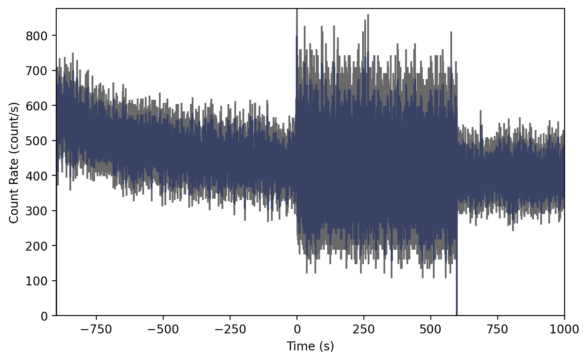
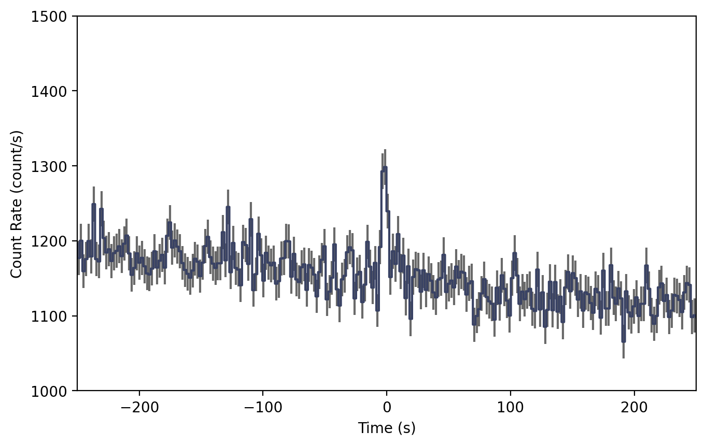
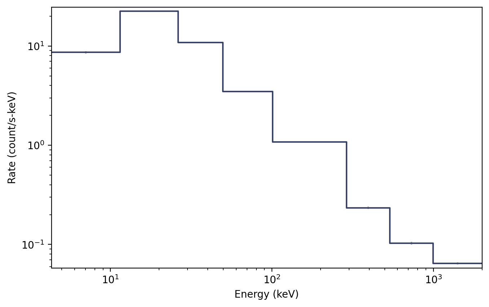

.. _gbm-phaii:
.. |GbmPhaii| replace:: :class:`~gdt.missions.fermi.gbm.phaii.GbmPhaii`
.. |Ctime| replace:: :class:`~gdt.missions.fermi.gbm.phaii.Ctime`
.. |Cspec| replace:: :class:`~gdt.missions.fermi.gbm.phaii.Cspec`
.. |TimeEnergyBins| replace:: :class:`~gdt.core.data_primitives.TimeEnergyBins`
.. |TimeBins| replace:: :class:`~gdt.core.data_primitives.TimeBins`
.. |EnergyBins| replace:: :class:`~gdt.core.data_primitives.EnergyBins`
.. |Phaii| replace:: :class:`~gdt.core.phaii.Phaii`
.. |Lightcurve| replace:: :class:`~gdt.plot.lightcurve.Lightcurve`
.. |Spectrum| replace:: :class:`~gdt.plot.spectrum.Spectrum`

**********************************************************
Fermi GBM PHAII Data (:mod:`gdt.missions.fermi.gbm.phaii`)
**********************************************************
The primary science data produced by GBM can be summarized as a time history of 
spectra, which is provided temporally pre-binned (CTIME and CSPEC) or 
temporally unbinned (TTE). These data types are produced as "snippets" for 
every single trigger and are also provided continuously. CTIME and CSPEC are 
provided in daily chunks, and TTE are provided in hourly chunks (since late 
2012). One of the most common things that a user of GBM data wants to do is 
look at this data (what we call a lightcurve) for one or more detectors over 
some energy range.

The CTIME and CSPEC data are temporally pre-binned data, which have 8 and 128 
energy channels respectively. These data files can be read by the |GbmPhaii|
class (or the aliased |Ctime| and |Cspec| classes).

    >>> from gdt.core import data_path
    >>> from gdt.missions.fermi.gbm.phaii import GbmPhaii
    >>> # read a ctime file
    >>> filepath = data_path.joinpath('fermi-gbm/glg_ctime_nb_bn120415958_v00.pha')
    >>> ctime = GbmPhaii.open(filepath)
    >>> ctime
    <Ctime: glg_ctime_nb_bn120415958_v00.pha;
     trigger time: 356223561.133346;
     time range (-899.3424419760704, 1000.8578699827194);
     energy range (4.323754, 2000.0)>

Since GBM uses the FITS format, the data files have multiple data extensions, 
each with metadata information in a header. There is also a primary header that 
contains metadata relevant to the overall file. You can access this metadata 
information:

    >>> ctime.headers.keys()
    ['PRIMARY', 'EBOUNDS', 'SPECTRUM', 'GTI']
    
    >>> ctime.headers['PRIMARY']
    CREATOR = 'GBM_SCI_Reader.pl v1.19' / Software and version creating file        
    FILETYPE= 'PHAII   '           / Name for this type of FITS file                
    FILE-VER= '1.0.0   '           / Version of the format for this filetype        
    TELESCOP= 'GLAST   '           / Name of mission/satellite                      
    INSTRUME= 'GBM     '           / Specific instrument used for observation       
    DETNAM  = 'NAI_11  '           / Individual detector name                       
    OBSERVER= 'Meegan  '           / GLAST Burst Monitor P.I.                       
    ORIGIN  = 'GIOC    '           / Name of organization making file               
    DATE    = '2012-04-16T02:15:21' / file creation date (YYYY-MM-DDThh:mm:ss UT)   
    DATE-OBS= '2012-04-15 22:45:25.975' / Date of start of observation              
    DATE-END= '2012-04-15 23:17:06.175' / Date of end of observation                
    TIMESYS = 'TT      '           / Time system used in time keywords              
    TIMEUNIT= 's       '           / Time since MJDREF, used in TSTART and TSTOP    
    MJDREFI =                51910 / MJD of GLAST reference epoch, integer part     
    MJDREFF = '0.0007428703703703703' / MJD of GLAST reference epoch, fractional par
    TSTART  =     356222661.790904 / [GLAST MET] Observation start time             
    TSTOP   =     356224561.991216 / [GLAST MET] Observation stop time              
    FILENAME= 'glg_ctime_nb_bn120415958_v00.pha' / Name of this file                
    DATATYPE= 'CTIME   '           / GBM datatype used for this file                
    TRIGTIME=     356223561.133346 / Trigger time relative to MJDREF, double precisi
    OBJECT  = 'GRB120415958'       / Burst name in standard format, yymmddfff       
    RADECSYS= 'FK5     '           / Stellar reference frame                        
    EQUINOX =               2000.0 / Equinox for RA and Dec                         
    RA_OBJ  =                 30.0 / Calculated RA of burst                         
    DEC_OBJ =                -15.0 / Calculated Dec of burst                        
    ERR_RAD =                  3.0 / Calculated Location Error Radius

There is easy access for certain important properties of the data:

    >>> # the good time intervals for the data
    >>> ctime.gti
    <Gti: 1 intervals; range (-899.3424419760704, 1000.8578699827194)>
    
    >>> # the trigger time
    >>> ctime.trigtime
    356223561.133346
    
    >>> # the time range
    >>> ctime.time_range
    (-899.3424419760704, 1000.8578699827194)
    
    >>> # the energy range
    >>> ctime.energy_range
    (4.323754, 2000.0)
    
    >>> # number of energy channels
    >>> ctime.num_chans
    8

We can retrieve the time history spectra data contained within the file, which
is a |TimeEnergyBins| class (see 
:external:ref:`2D Binned Data<core-data_primitives-2d>` for more details).

    >>> ctime.data
    <TimeEnergyBins: 14433 time bins;
     time range (-899.3424419760704, 1000.8578699827194);
     1 time segments;
     8 energy bins;
     energy range (4.323754, 2000.0);
     1 energy segments>

Through the |Phaii| base class, there are a lot of high level functions 
available to us, such as slicing the data in time or energy:

    >>> time_sliced_ctime = ctime.slice_time((-10.0, 10.0))
    >>> time_sliced_ctime
    <Ctime: 
     trigger time: 356223561.133346;
     time range (-10.240202009677887, 10.048128008842468);
     energy range (4.323754, 2000.0)>

    >>> energy_sliced_ctime = ctime.slice_energy((50.0, 500.0))
    >>> energy_sliced_ctime
    <Ctime: 
     trigger time: 356223561.133346;
     time range (-899.3424419760704, 1000.8578699827194);
     energy range (49.60019, 538.1436)>

As mentioned, this data is 2-dimensional, so what do we do if we want a 
lightcurve covering a particular energy range? We integrate (sum) over energy, 
and we can easily do this:

    >>> lightcurve = ctime.to_lightcurve(energy_range=(50.0, 500.0))
    >>> lightcurve
    <TimeBins: 14433 bins;
     range (-899.3424419760704, 1000.8578699827194);
     1 contiguous segments>

Similarly, we can integrate over time to produce a count spectrum:
    
    >>> spectrum = ctime.to_spectrum(time_range=(-10.0, 10.0))
    >>> spectrum
    <EnergyBins: 8 bins;
     range (4.323754, 2000.0);
     1 contiguous segments>

The resulting objects are |TimeBins| and |EnergyBins|, respectively, and see
:external:ref:`1D Binned Data<core-data_primitives-1d>` for more details on how 
to use them.

Of course, once we have produced a lightcurve or spectrum data object, often
we want to plot it.  For that, we use the |Lightcurve| and |Spectrum| plotting
classes:
    
    >>> import matplotlib.pyplot as plt
    >>> from gdt.plot.lightcurve import Lightcurve
    >>> lcplot = Lightcurve(data=lightcurve)
    >>> plt.show()

This plot may look odd without context. Since we are reading a trigger CTIME 
file, the file contains multiple time resolutions. Normally the CTIME data is 
accumulated in 256 ms duration bins, but starting at trigger time, the data 
switches to 64 ms duration bins for several hundred seconds, and then it goes 
back to 256 ms bins.

So maybe the native CTIME resolution is overkill because it's hard to see the 
signal. We can make it easier to see the signal if we bin it up (see 
:external:ref:`The Binning Package<binning>` for details):

    >>> from gbm.binning.binned import rebin_by_time
    >>> # rebin the data to 2.048 s resolution
    >>> rebinned_ctime = ctime.rebin_time(rebin_by_time, 2.048)
    >>> lcplot = Lightcurve(data=rebinned_ctime.to_lightcurve())
    >>> # zoom in
    >>> lcplot.xlim = (-250.0, 250.0)
    >>> lcplot.ylim = (1000.0, 1500.0)
    
After rebinning the data and zooming in a little, we can now easily see the 
GRB signal in the lightcurve.

Similarly, we can plot the count spectrum:

    >>> from gdt.plot.spectrum import Spectrum
    >>> specplot = Spectrum(data=spectrum)
    >>> plt.show()

See :external:ref:`Plotting Lightcurves<plot-lightcurve>` and 
:external:ref:`Plotting Count Spectra<plot-spectrum>` for more on
how to modify these plots.

Finally, we can write out a new fully-qualified PHAII FITS file after some 
reduction tasks.  For example, we can write out our time-sliced data object:

    >>> time_sliced_ctime.write('./', filename='my_first_custom_ctime.pha')

For more details about working with PHAII data, see 
:external:ref:`PHAII Files<core-phaii>`.
 
Reference/API
=============

.. automodapi:: gdt.missions.fermi.gbm.phaii
   :inherited-members:

