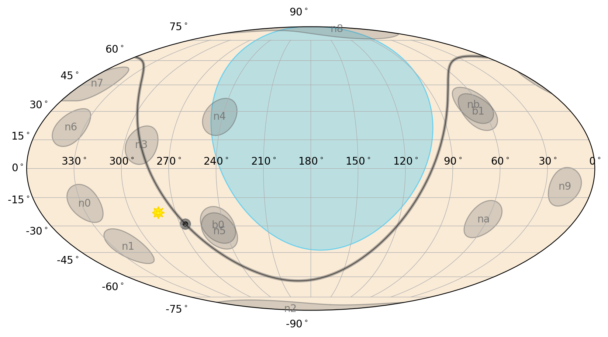
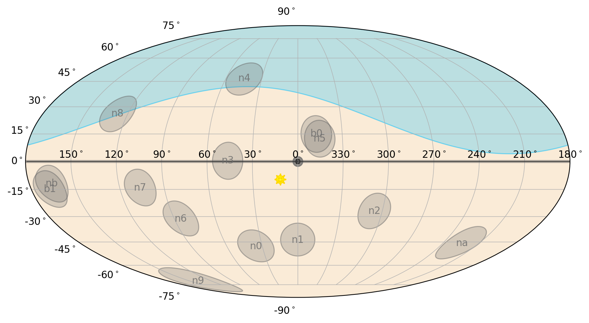
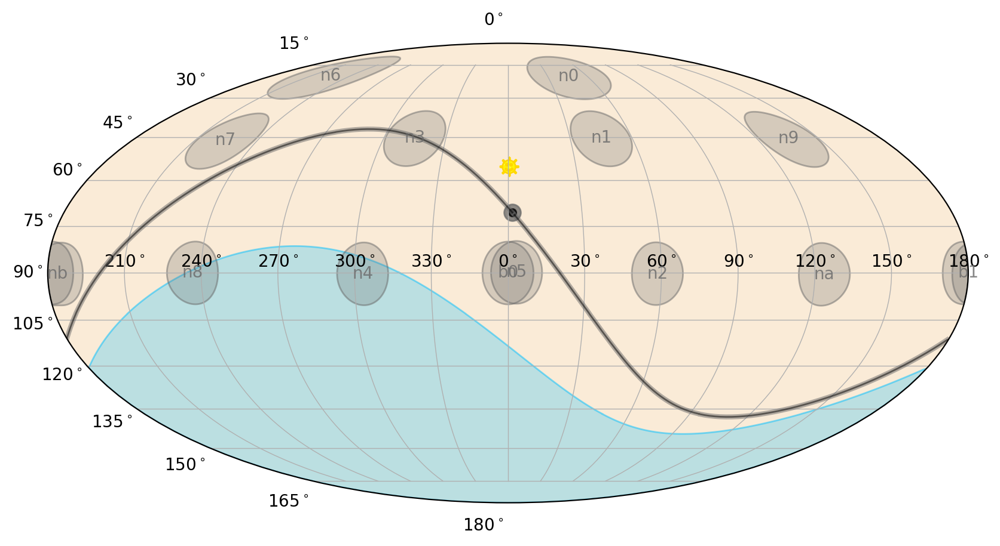

.. _gbm-poshist:
.. |GbmPosHist| replace:: :class:`~gdt.missions.fermi.gbm.poshist.GbmPosHist`
.. |Gti| replace:: :class:`~gdt.core.data_primitives.Gti`
.. |SpacecraftFrame| replace:: :class:`~gdt.core.coords.SpacecraftFrame`

********************************************************************************
Fermi GBM Position/Attitude History Data (:mod:`gdt.missions.fermi.gbm.poshist`)
********************************************************************************
Probably the most critical auxiliary file GBM produces is the position history 
(POSHIST) file. The POSHIST contains, for an entire day, the spacecraft 
location in orbit and pointing information, sampled on a 1 second timescale. 
If you are just interested in triggered GRB analysis where all of the response 
files are already made for you, then POSHIST may not be of much interest. But 
if you are using the continuous data in any way, the POSHIST is your dearest 
friend. You may want to know if a source is visible at a particular time 
(i.e. not behind the Earth), and if it is, what is the closest detector to the 
source. You may want to know if there are specific contributions to the 
background during a time interval, such as sun visibility or high geomagnetic 
latitude in orbit. You may want to rotate something from the equatorial frame 
to the Fermi inertial frame, or vice versa. Or you may want to make a pretty 
gif of the detector pointings over time.

To read a POSHIST file, we open it with the |GbmPosHist| class:

    >>> from gdt.core import data_path
    >>> from gdt.missions.fermi.gbm.poshist import GbmPosHist
    >>> filepath = data_path.joinpath('fermi-gbm/glg_poshist_all_170101_v01.fit')
    >>> poshist = GbmPosHist.open(filepath)
    >>> poshist
    <GbmPosHist(filename="glg_poshist_all_170101_v01.fit") at 0x12b372640>

The poshist object contains the spacecraft **frame**, which is the spacecraft
position and orientation as a function of time, and the spacecraft **states**,
which are the series of state flags as a function of time.

To see what state flags are available, we can retrieve the spacecraft states
in the following way:

    >>> states = poshist.get_spacecraft_states()
    >>> states
    <TimeSeries length=86520>
          time       sun   saa  good
          Time       bool  bool bool
    ---------------- ---- ----- ----
    504921545.740106 True False True
    504921546.740107 True False True
    504921547.740107 True False True
    504921548.740106 True False True
                 ...  ...   ...  ...
    505008060.340076 True False True
    505008061.340078 True False True
    505008062.340075 True False True
    505008063.340076 True False True
    505008064.340076 True False True

The state flags are stored in an Astropy TimeSeries object, and for each
sampled time, there is a flag denoting if the sun is visible, if the spacecraft
is in SAA, and if the data are in a good time interval (which in this case is
just the opposite of the SAA flag).

We can, for example create a Good Time Intervals |Gti| object from the ``time``
and ``good`` columns:

    >>> from gdt.core.data_primitives import Gti
    >>> gti = Gti.from_boolean_mask(states['time'].value, states['good'].value)
    >>> gti
    <Gti: 10 intervals; range (504921545.740106, 505008064.340076)>

Regarding the spacecraft frame, we can retrieve it as a |SpacecraftFrame| 
object:

    >>> frame = poshist.get_spacecraft_frame()
    <SpacecraftFrame: 86520 frames;
     obstime=[504921545.740106, ...]
     obsgeoloc=[(-6315714., -1549390.6, 2302684.5) m, ...]
     obsgeovel=[(1011.3916, -7244.9014, -2100.9446) m / s, ...]
     quaternion=[(x, y, z, w) [-0.21889446,  0.00818764,  0.65160715, -0.72624121], ...]>

You will notice that this frame has a location in Earth Inertial Coordinates 
(``obsgeoloc``), the velocity of the spacecraft with reference to the Earth 
Inertial Coordinate frame (``obsgeovel``), and the spacecraft orientation
quaternion, each for a given time stamp (``obstime``).

Let's say we are interested in data around a specific time, for example 
MET=504975500. We can generate an interpolated frame at the requested time, as
long as it exists within the boundaries of the file.
    
    >>> from gdt.missions.fermi.time import *
    >>> time = Time(504975500, format='fermi')
    >>> one_frame = frame.at(time)
    >>> one_frame
    <SpacecraftFrame: 1 frames;
     obstime=[504975500.0]
     obsgeoloc=[(6294771.65990569, -825118.18949373, -2751704.74152787) m]
     obsgeovel=[(1531.48673123, 7317.65930685, 1296.24008645) m / s]
     quaternion=[(x, y, z, w) [ 0.20026199, -0.66690538,  0.49459807, -0.52010105]]>

We can retrieve where Fermi was in orbit at that time:

    >>> one_frame.earth_location.lat, one_frame.earth_location.lon
    (<Latitude -23.46926302 deg>, <Longitude 26.7365118 deg>)
    >>>one_frame.earth_location.height
    <Quantity 544542.2936586 m>)

We might be interested to know where the Earth is (and its apparent radius) 
relative to Fermi:

    >>> one_frame.geocenter.ra, one_frame.geocenter.dec
    (<Longitude 172.53224953 deg>, <Latitude 23.43352709 deg>)
    
    >>> one_frame.earth_angular_radius
    <Quantity 67.1226193 deg>

We could also be interested in a particular known source, and it would be 
helpful to know if it is even visible to Fermi at the time of interest:

    >>> from astropy.coordinates import SkyCoord
    >>> coord = SkyCoord(324.3, -20.8, frame='icrs', unit='deg')
    >>> one_frame.location_visible(coord)
    True

Well, that's good to know. But we want to look at the data for the closest 
detector to that position. We can figure that out. For example, we can determine
the angle between the 'n0' detector and that position on the sky:

    >>> one_frame.detector_angle('n0', coord)
    <Angle [4.27219806] deg>

Sometimes it's useful to transform a source location of interest in equatorial 
coordinates to the Fermi inertial frame. You can do that by the following:

    >>> coord_sc_frame = coord.transform_to(one_frame)
    >>> coord_sc_frame.az, coord_sc_frame.el
    (<Longitude [39.67934005] deg>, <Latitude [65.85535956] deg>)

Note that the frame transformation is in azimuth and **elevation**.  It's 
important to note that the Fermi inertial frame is defined by azimuth 
(0-360 deg) and elevation (-90-90 deg) or zenith (0-180 deg). Here, azimuth=0 
is approximately the pointing of detector NaI 5, and increases 
counter-clockwise when looking down the LAT boresight. Elevation=90 (zenith=0)
is defined as the LAT boresight, and elevation=-90 (zenith=180) is directly 
below the spacecraft.

You can also go from Fermi (azimuth, elevation) coordinates to equatorial 
coordinates:
    
    >>> # Az=0, El=90 (the Fermi LAT boresight)
    >>> sc_coord = SkyCoord(0.0, 90.0, frame=one_frame, unit='deg')
    >>> sc_coord.icrs
    <SkyCoord (ICRS): (ra, dec) in deg
        [(333.15399016, 1.73430464)]>

Note that any and all of these operations can be performed on an array of 
frames, even on the entire series of frames contained within the poshist file.
For more details on working with the |SpacecraftFrame|, 
see :external:ref:`Spacecraft Attitude, Position, and Coordinates<core-coords>`.

Now all of this great, but we can also make a sky plot at a given time.  We
can plot in either the Equatorial frame:
    
    >>> from matplotlib.pyplot as plt
    >>> from gdt.plot.sky import EquatorialPlot
    >>> eqplot = EquatorialPlot()
    >>> eqplot.add_frame(one_frame)
    >>> plt.show()

Or the Galactic Frame:

    >>> from gdt.plot.sky import GalacticPlot
    >>> galplot = GalacticPlot()
    >>> galplot.add_frame(one_frame)
    >>> plt.show()

Or the Spacecraft Frame:

    >>> from gdt.plot.sky import SpacecraftPlot
    >>> scplot = SpacecraftPlot()
    >>> scplot.add_frame(one_frame)
    >>> plt.show()

See :external:ref:`Plotting Sky Maps, Localizations, and Wide-field Effective 
Area<plot-sky>` for more details on these plots.

Finally, we can plot a segment of the Fermi orbit and the location of Fermi at
our desired time:

    
    >>> from gdt.missions.fermi.plot import FermiEarthPlot
    >>> from gdt.missions.fermi.gbm.saa import GbmSaa
    >>> earthplot = FermiEarthPlot(saa=GbmSaa())
    >>> # orbit segment 1000 s prior to our time of interest and 1000 s after
    >>> earthplot.add_spacecraft_frame(frame, tstart=Time(time.fermi-1000, format='fermi'), 
    >>>                                tstop=2000, trigtime=time)
    >>> earthplot.standard_title()
    >>> plt.show()

 .. image:: poshist_figs/poshistfig4.png
   

Reference/API
=============

.. automodapi:: gdt.missions.fermi.gbm.poshist
   :inherited-members:

