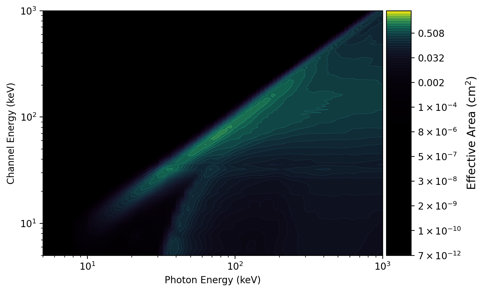
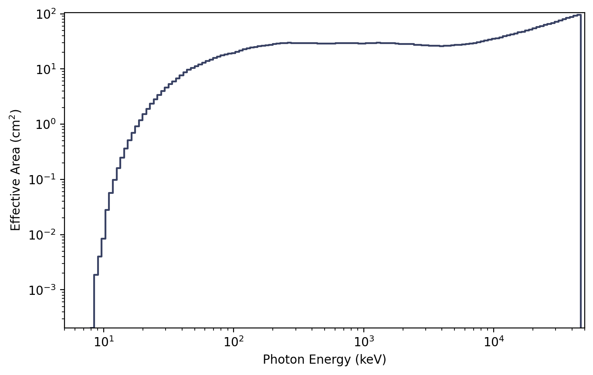
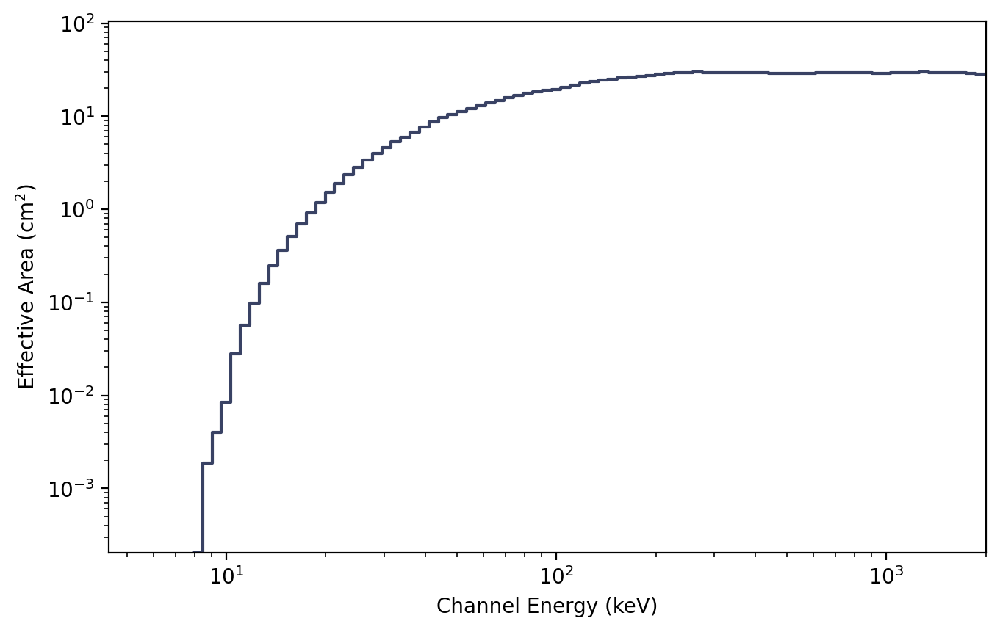

.. _gbm-response:
.. |GbmRsp| replace:: :class:`~gdt.missions.fermi.gbm.response.GbmRsp`
.. |GbmRsp2| replace:: :class:`~gdt.missions.fermi.gbm.response.GbmRsp2`
.. |ResponseMatrix| replace:: :class:`~gdt.core.data_primitives.ResponseMatrix`
.. |PowerLaw| replace:: :class:`~gdt.core.spectra.functions.PowerLaw`
.. |EnergyBins| replace:: :class:`~gdt.core.data_primitives.EnergyBins`
.. |ResponsePlot| replace:: :class:`~gdt.core.plot.drm.ResponsePlot`
.. |PhotonEffectiveArea| replace:: :class:`~gdt.core.plot.drm.PhotonEffectiveArea`
.. |ChannelEffectiveArea| replace:: :class:`~gdt.core.plot.drm.ChannelEffectiveArea`

*********************************************************************
Fermi GBM Detector Responses (:mod:`gdt.missions.fermi.gbm.response`)
*********************************************************************
The GBM detector response files allow you to compare a theoretical photon 
spectrum to an observed count spectrum. In short, a single detector response 
file is only useful for its corresponding detector, for a given source position 
on the sky, and a given time (or relatively short time span). Essentially, one 
file contains one or more detector response matrices (DRMs) encoding the energy 
dispersion and calibration of incoming photons at different energies to recorded 
energy channels. The matrix also encodes the effective area of the detector as a 
function of energy for a given source position relative to the detector pointing. 
This effective area can change dramatically as there is a strong 
angular-dependence of the response (and the angular-dependence changes with 
energy!). A file that contains a single DRM will be named with a '.rsp' 
extension, and a file containing more than one DRM will be named with a '.rsp2' 
extension. These can be accessed with |GbmRsp| and |GbmRsp2| classes, 
respectively. The rsp2 files typically have a DRM generated for every x degrees 
of spacecraft slew relative to the source, useful for studying the spectrum of 
transients that may be several tens or hundreds of seconds long (and therefore 
the detector pointing is changing singificantly relative to the source).

Similar to the science data, we can open/read a response file in the following 
way:

    >>> from gdt.core import data_path
    >>> from gdt.missions.fermi.gbm.response import GbmRsp2
    >>> filepath = data_path.joinpath('fermi-gbm/glg_cspec_n4_bn120415958_v00.rsp2')
    >>> rsp2 = GbmRsp2.open(filepath)
    >>> rsp2
    <GbmRsp2: glg_cspec_n4_bn120415958_v00.rsp2;
     trigger time: 356223561.133346; 12 DRMs;
     time range (-129.02604603767395, 477.1912539601326)>

This is an rsp2 file, so there are multiple DRMs contained, covering the 
specified time range.  There are a number of attributes available to us:

    >>> rsp2.num_drms
    12
    >>> # number of energy channels
    >>> rsp2.num_chans
    128
    >>> # number of input photon bins
    >>> rsp2.num_ebins
    140
    >>> # time centroids for each DRM
    >>> rsp2.tcent
    array([-104.44964603,  -55.29684603,   -8.19209602,   37.37660399,
             84.48130399,  133.12205398,  182.27480397,  251.90785396,
            321.54095396,  370.69370398,  419.84640399,  460.80700397])

An rsp2 file containing multiple DRMs indicates there is a DRM that is most 
appropriate to use for a given time. We can find the DRM that is closest to 
our time of interest:
    
    >>> # return the detector response covering T0
    >>> rsp = rsp2.nearest_drm(0.0)
    >>> rsp
    <GbmRsp: 
     trigger time: 356223561.133346;
     time range (-30.720446050167084, 14.336254000663757);
     140 energy bins; 128 channels>

Notice that this returns a single-DRM response object.  We can access the DRM
directly, which is a |ResponseMatrix| object:

    >>> rsp.drm
    <ResponseMatrix: 140 energy bins; 128 channels>

We can fold a photon model through the response matrix to get out a count 
spectrum.  For example, we fold a |PowerLaw| photon model:

    >>> from gdt.core.spectra.functions import PowerLaw
    >>> pl = PowerLaw()
    >>> # power law with amplitude=0.01, index=-2.0
    >>> rsp.fold_spectrum(pl.fit_eval, (0.01, -2.0))
    <EnergyBins: 128 bins;
     range (4.400000095367432, 2000.0);
     1 contiguous segments>

This returns an |EnergyBins| object containing the count spectrum.  See 
:external:ref:`Instrument Responses<core-response>` for more information on 
working with single-DRM responses.

Instead of retrieving the nearest DRM to our time of interest, we can also
interpolate the Rsp2 object:

    >>> rsp_interp = rsp2.interpolate(0.0)
    <GbmRsp: 
     trigger time: 356223561.133346;
     time range (0.0, 0.0);
     140 energy bins; 128 channels>

What does a DRM actually look like? We can make a plot of one using the 
|ResponsePlot|:

    >>> import matplotlib.pyplot as plt
    >>> from gdt.core.plot.drm import ResponsePlot
    >>> drmplot = ResponsePlot(rsp_interp.drm)
    >>> drmplot.xlim = (5.0, 1000.0)
    >>> drmplot.ylim = (5.0, 1000.0)
    >>> plt.show()

What we see in the plot is a diagonal edge that contains a majority of the 
effective area. This approximately linear mapping of photon energy to energy 
channel is called the photopeak. There is also see a bunch of off-diagonal 
contribution from photons deposited into energy channels lower than the 
original photon energy. This presence of non-negligible off-diagonal response 
is one of the reasons that the DRM is not invertible (our lives would be so 
much easier if was, though). This particular DRM contains a lot of off-diagonal 
effective area, in part because this example was made for a very large source 
angle from the detector normal.

    >>> # detector-source angle of this response
    >>> rsp_interp.headers['SPECRESP MATRIX']['DET_ANG']
    138.3

We can also make a plot of the effective area integrated over photon energies 
using |PhotonEffectiveArea|:

    >>> from gdt.core.plot.drm import PhotonEffectiveArea,
    >>> effarea_plot = PhotonEffectiveArea(rsp_interp.drm)
    >>> plt.show()

Or over energy channels using |ChannelEffectiveArea|:

    >>> from gdt.core.plot.drm import ChannelEffectiveArea
    >>> effarea_plot = ChannelEffectiveArea(rsp_interp.drm)
    >>> plt.show()

For more details about customizing these plots, see 
:external:ref:`Plotting DRMs and Effective Area<plot-drm>`.

Reference/API
=============

.. automodapi:: gdt.missions.fermi.gbm.response
   :inherited-members:

