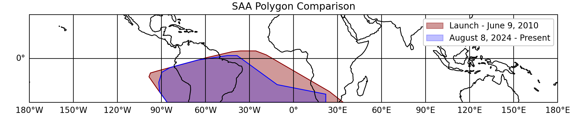

.. _gbm-saa:
.. |GbmSaa| replace:: :class:`~gdt.missions.fermi.gbm.saa.GbmSaa`
.. |GbmSaaPolygon1| replace:: :class:`~gdt.missions.fermi.gbm.saa.GbmSaaPolygon1`
.. |GbmSaaPolygon2| replace:: :class:`~gdt.missions.fermi.gbm.saa.GbmSaaPolygon2`
.. |GbmSaaCollection| replace:: :class:`~gdt.missions.fermi.gbm.saa.GbmSaaCollection`
.. |FermiEarthPlot| replace:: :class:`~gdt.missions.fermi.plot.FermiEarthPlot`

*********************************************************************
Fermi GBM SAA Boundary Definition (:mod:`gdt.missions.fermi.gbm.saa`)
*********************************************************************
The South Atlantic Anomaly (SAA) region is an area of high particle 
particle flux in the Earth's Van Allen belts. Whenever Fermi is near
this region, the detectors are turned off and not collecting data.

The boundary of the SAA region is defined using a polygon in latitude
and longitude. The definition of this boundary was changed once during
GBM operations, resulting in two distinct periods:

* |GbmSaaPolygon1| **(Launch - July 23, 2024):** Original SAA boundary
  used during the first 16 years of operations. This definition
  is conservative and includes a large portion of the southern
  Atlantic ocean.
* |GbmSaaPolygon2| **(July 23, 2024 - present):** Updated SAA boundary
  implemented during the fourth gravitational wave observing
  run (O4). This definition is designed to increase detector uptime
  by reducing the area of the SAA boundary to more closely
  follow the limits of the Van Allen belts.

We can retrieve the latitude and longitude values for a specific
boundary by initializing the corresponding class. For example,
we can obtain the original SAA boundary by using the
|GbmSaaPolygon1| class:

    >>> from gdt.missions.fermi.gbm.saa import GbmSaaPolygon1
    >>> saa = GbmSaaPolygon1()
    >>> saa.latitude
    array([-30.   , -19.867,  -9.733,   0.4  ,   2.   ,   2.   ,  -1.   ,
            -6.155,  -8.88 , -14.22 , -18.404, -30.   , -30.   ])
    >>> saa.longitude
    array([ 33.9  ,  12.398,  -9.103, -30.605, -38.4  , -45.   , -65.   ,
           -84.   , -89.2  , -94.3  , -94.3  , -86.1  ,  33.9  ])

We can also plot the SAA boundary using |FermiEarthPlot|:

    >>> import matplotlib.pyplot as plt
    >>> from gdt.missions.fermi.plot import FermiEarthPlot
    >>> plot = FermiEarthPlot(saa=saa, mcilwain=False)
    >>> plt.show()
    
.. image:: saa_figs/saafig1.png

The SAA region in this plot is marked in red.  For more details on customizing
these plots, including the SAA region, see 
:external:ref:`Plotting Spacecraft in Earth Orbit<plot-earthplot>`.

Users looking to retrieve the latest SAA boundary definition should use the
|GbmSaaCollection| class, which collects and sorts all available SAA boundaries
according to time. The boundaries are available as a list via the
:attr:`~gdt.missions.fermi.gbm.saa.GbmSaaCollection.polygons` attribute
with the last element being the latest boundary:

    >>> from gdt.missions.fermi.gbm.saa import GbmSaaCollection
    >>> collection = GbmSaaCollection()
    >>> latest_saa = collection.polygons[-1]

The overlay below shows a comparison between the original and latest SAA boundaries.
Note that the latest boundary is essentially just a trimmed down version of the original.

The |GbmSaaCollection| class can also return the SAA polygon definition
at a specific time using the :meth:`~gdt.missions.fermi.gbm.saa.GbmSaaCollection.at`
method with an Astropy ``Time`` object:

    >>> from astropy.time import Time
    >>> saa = collection.at(Time("2024-01-01T00:00:00", format="isot", scale="utc"))

This avoids the need to manually instance individual SAA classes.

Backwards Compatability
-----------------------

The |GbmSaa| class provides a copy of the original SAA definition
in order to support compatibility with code written before API version 2.1.1,
which only defined the original boundary. It is exactly equivalent to
working with |GbmSaaPolygon1|:

    >>> from gdt.missions.fermi.gbm.saa import GbmSaa
    >>> saa = GbmSaa()
    >>> saa.latitude
    array([-30.   , -19.867,  -9.733,   0.4  ,   2.   ,   2.   ,  -1.   ,
            -6.155,  -8.88 , -14.22 , -18.404, -30.   , -30.   ])
    >>> saa.longitude
    array([ 33.9  ,  12.398,  -9.103, -30.605, -38.4  , -45.   , -65.   ,
           -84.   , -89.2  , -94.3  , -94.3  , -86.1  ,  33.9  ])

Reference/API
=============

.. automodapi:: gdt.missions.fermi.gbm.saa
   :inherited-members:

