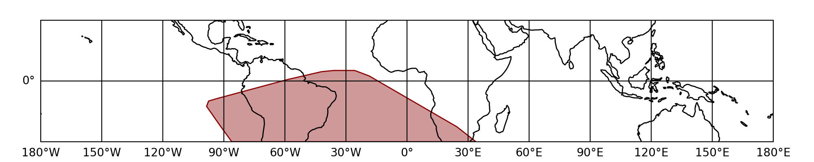

.. _gbm-saa:
.. |GbmSaa| replace:: :class:`~gdt.missions.fermi.gbm.saa.GbmSaa`
.. |FermiEarthPlot| replace:: :class:`~gdt.missions.fermi.plot.FermiEarthPlot`

*********************************
Fermi GBM SAA Boundary Definition
*********************************
The South Atlantic Anomaly (SAA) region is defined by a polygon in latitude
and longitude.  Whenever Fermi is within this region, the detectors are turned
off and not collecting data.  We can easily retrieve the boundary values for
this polygon using the |GbmSaa| class:

    >>> from gdt.missions.fermi.gbm.saa import GbmSaa
    >>> saa = GbmSaa()
    >>> saa.latitude
    array([-30.   , -19.867,  -9.733,   0.4  ,   2.   ,   2.   ,  -1.   ,
            -6.155,  -8.88 , -14.22 , -18.404, -30.   , -30.   ])
    >>> saa.longitude
    array([ 33.9  ,  12.398,  -9.103, -30.605, -38.4  , -45.   , -65.   ,
           -84.   , -89.2  , -94.3  , -94.3  , -86.1  ,  33.9  ])
    
Aside from a few convenience functions, the SAA boundary is most useful when
plotting the Fermi orbit using |FermiEarthPlot|:

    >>> import matplotlib.pyplot as plt
    >>> from gdt.missions.fermi.plot import FermiEarthPlot
    >>> plot = FermiEarthPlot(saa=saa, mcilwain=False)
    >>> plt.show()
    

The SAA region in this plot is marked in red.  For more details on customizing
these plots, including the SAA region, see :ref:`Plotting Spacecraft in Earth 
Orbit`.
    
Reference/API
=============

.. automodapi:: gdt.missions.fermi.gbm.saa
   :inherited-members:

