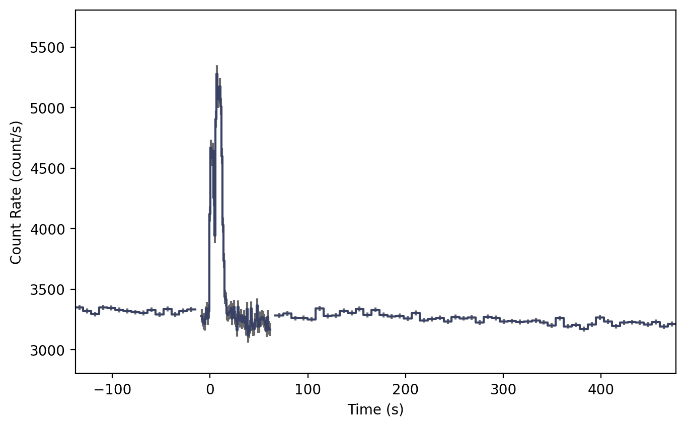
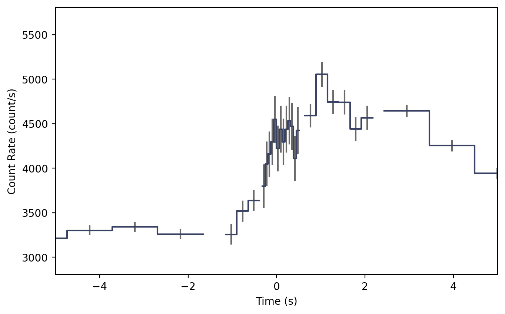
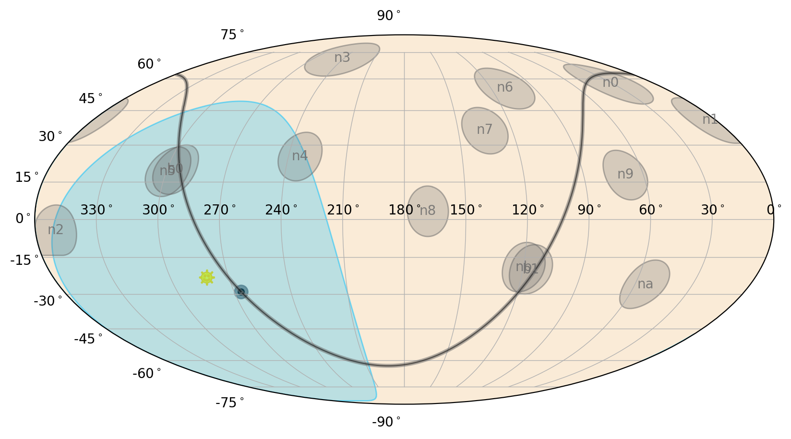
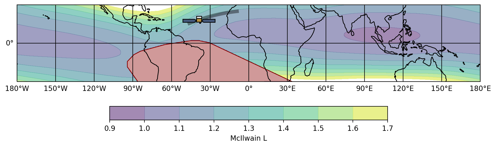

.. _gbm-trigdat:
.. |Trigdat| replace:: :class:`~gdt.missions.fermi.gbm.trigdat.Trigdat`
.. |GbmPhaii| replace:: :class:`~gdt.missions.fermi.gbm.phaii.GbmPhaii`
.. |Lightcurve| replace:: :class:`~gdt.plot.lightcurve.Lightcurve`
.. |to_phaii| replace:: :meth:`~gdt.missions.fermi.gbm.trigdat.Trigdat.to_phaii`
.. |sum_detectors| replace:: :meth:`~gdt.missions.fermi.gbm.trigdat.Trigdat.sum_detectors`

**************************************************************
Fermi GBM Trigger Data (:mod:`gdt.missions.fermi.gbm.trigdat`)
**************************************************************
TRIGDAT was designed so that it contains the minimum amount of data required 
for rapid on-ground characterization and localization of triggers. To that 
purpose, the TRGIDAT contains 8-channel pre-binned lightcurve data for each of 
the 14 detectors along with spacecraft position and attitude information for 
each bin. The lightcurve data, though, has multiple resolutions. There are 
"background" time bins of duration 8.124 s from the start of the trigger data 
to just before trigger time, and then about 50 s after the trigger time through 
the rest of the data. In between the two segments of "background" bins, there 
are 1.024 s duration bins, and in a very short window around the trigger time, 
there are overlapping bins of width 256 and 64 ms. This design enables a 
preliminary rapid analysis for long duration triggers that can last from
several tens of seconds down sub-second duration triggers. The fact that the 
different bin timescales are overlapping creates difficulty if you want to 
make lightcurve plots, but the |Trigdat| class solves this problem for you.

Let's open a TRIGDAT file:

    >>> from gdt.core import data_path
    >>> from gdt.missions.fermi.gbm.trigdat import Trigdat
    >>> filepath = data_path.joinpath('fermi-gbm/glg_trigdat_all_bn170101116_v01.fit')
    >>> trigdat = Trigdat.open(filepath)
    >>> trigdat
    <Trigdat: glg_trigdat_all_bn170101116_v01.fit;
     trigtime=504931642.87; triggered detectors=['n9', 'na', 'nb']>

There is a ton of metadata and extensions related to how the trigger was 
processed onboard the spacecraft: the trigger timescale and rates in each 
detector, the simple background rates that are used onboard the spacecraft, 
and the onboard trigger classification and localization information. We really 
won't delve into all of that other than to point out that it exists and is 
accessible through the Trigdat attributes and methods. As for the extensions:

    >>> trigdat.headers.keys()
    ['PRIMARY', 'TRIGRATE', 'BCKRATES', 'OB_CALC', 'MAXRATES', 'EVNTRATE']

The pertinent data we want to use is in the 'EVNTRATE' extension. Since this 
contains the 8-channel lightcurve for each of the detectors, we can extract the 
data for a detector and return it as PHAII object:

    >>> phaii = trigdat.to_phaii('n0')
    >>> phaii
    <GbmPhaii: 
     trigger time: 504931642.867272;
     time range (-137.85839196872712, 476.55260199308395);
     energy range (3.4, 2000.0)>

Once extracted, it has the full capabilities of the |GbmPhaii| class. We can 
also retrieve the sum of the detectors:

    >>> # the triggered detectors
    >>> trig_dets = trigdat.triggered_detectors
    >>> trig_dets
    ['n9', 'na', 'nb']
    
    >>> summed_phaii = trigdat.sum_detectors(trig_dets)
    >>> summed_phaii
    <GbmPhaii: 
     trigger time: 504931642.867272;
     time range (-137.85839196872712, 476.55260199308395);
     energy range (3.4, 2000.0)>
    >>> summed_phaii.detector
    'n9+na+nb'
    
And then we can plot the lightcurve using the |Lightcurve| class (see 
:external:ref:`Plotting Lightcurves<plot-lightcurve>` for more info):

    >>> import matplotlib.pyplot as plt
    >>> from gdt.plot.lightcurve import Lightcurve
    >>> lcplot = Lightcurve(summed_phaii.to_lightcurve())
    >>> plt.show()

The plot shows where the 8 s timescale changes to the 1 s timescale and then 
back to the 8 s timescale. By default, we retrieve the 8-s and 1-s data for the 
lightcurve, but what if we want to retrieve the 256 ms or 64 ms timescales? 
We can do that by giving |to_phaii| or |sum_detectors| a 
timescale keyword:

    >>> # retrieve all timescales 64 ms up to 8 s
    >>> # possible options for timescale is 64, 256, or 1024
    >>> summed_phaii = trigdat.sum_detectors(trig_dets, timescale=64)

    >>> lcplot = Lightcurve(data=summed_phaii.to_lightcurve())
    >>> lcplot.xlim = (-5.0, 5.0)

All timescales are now plotted and merged into a single lightcurve. The 64 ms 
option will return all timescales at >= 64 ms, while the 256 ms option will 
return all timescales >= 256 ms. This lightcurve doesn't look particularly 
pretty because it's a long-duration GRB, but short GRBs show up very nicely on 
the 64 and 256 ms timescales.

As mentioned earlier, TRIGDAT also contains spacecraft position history and 
attitude information. This means that nearly everything we can do with 
standard position history data can alse be done with TRIGDAT. For example, we 
can determine where the detectors were pointing at the time of the trigger:

    >>> from gdt.missions.fermi.time import *
    >>> time = Time(trigdat.trigtime, format='fermi')
    >>> # the spacecraft frame at trigger time
    >>> frame = trigdat.poshist.at(time)
    >>> # get n9 pointing in the ICRS frame
    >>> trigdat.poshist.detectors.n9.skycoord(frame).icrs
    <SkyCoord (ICRS): (ra, dec) in deg
        [(68.87778267, 17.76359435)]>

See :ref:`Fermi GBM Position/Attitude History Data<gbm-poshist>` for more 
information about working with position history data.  

We can also make a sky plot:

    >>> from gdt.plot.sky import EquatorialPlot
    >>> eqplot = EquatorialPlot()
    >>> eqplot.add_frame(trigdat.poshist.at(time))

Or even an orbital plot:

    >>> from gdt.missions.fermi.plot import FermiEarthPlot
    >>> from gdt.missions.fermi.gbm.saa import GbmSaa
    >>> earthplot = FermiEarthPlot(saa=GbmSaa())
    >>> earthplot.add_spacecraft_frame(trigdat.poshist, trigtime=time)

See :external:ref:`Plotting Sky Maps, Localizations, and Wide-field Effective 
Area<plot-sky>` and 
:external:ref:`Plotting Spacecraft in Earth Orbit<plot-earthplot>`, 
respectively, for more details on these plots.

Reference/API
=============

.. automodapi:: gdt.missions.fermi.gbm.trigdat
   :inherited-members:

