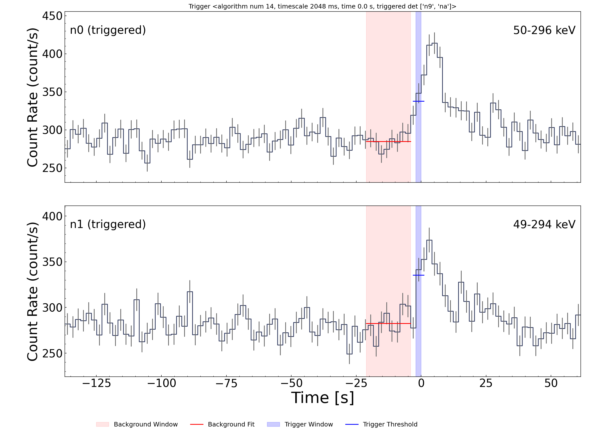
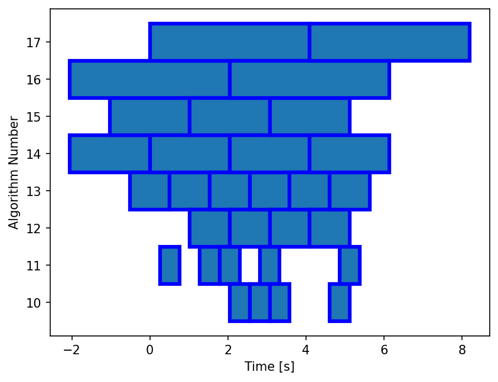
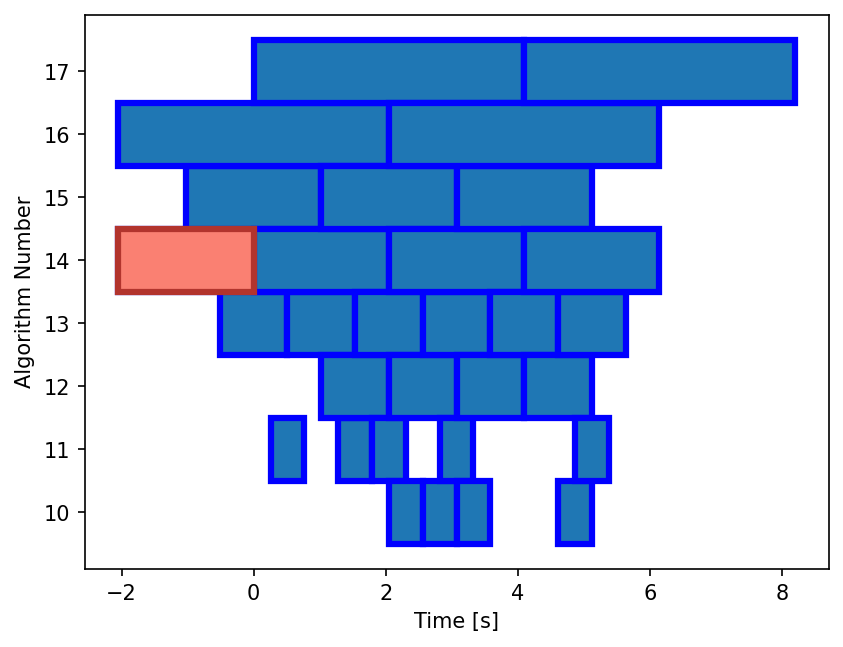
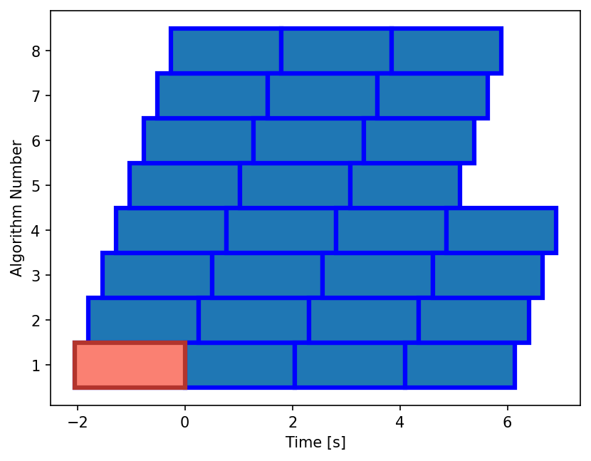

.. _gbm-trigger:
.. |GbmOnboardTrigger| replace:: :class:`~gdt.missions.fermi.gbm.trigger.GbmOnboardTrigger`
.. |TriggerAlgorithm| replace:: :class:`~gdt.core.trigger.TriggerAlgorithm`
.. |prepare_data| replace:: :meth:`~gdt.missions.fermi.gbm.trigger.GbmOnboardTrigger.prepare_data`
.. |apply_trigger| replace:: :meth:`~gdt.missions.fermi.gbm.trigger.GbmOnboardTrigger.apply_trigger`
.. |lightcurve_plot| replace:: :meth:`~gdt.missions.fermi.gbm.trigger.GbmOnboardTrigger.lightcurve_plot`
.. |waterfall_plot| replace:: :meth:`~gdt.missions.fermi.gbm.trigger.GbmOnboardTrigger.waterfall_plot`
.. |apply_holdoff| replace:: :meth:`~gdt.missions.fermi.gbm.trigger.GbmOnboardTrigger.apply_holdoff`

******************************************************
Fermi GBM Trigger Algorithm (:mod:`gdt.missions.fermi.gbm.trigger`)
******************************************************

The |GbmOnboardTrigger| class provides an implementation of the Fermi GBM onboard trigger logic; designed to replicate how transients are detected in flight. 
The onboard system identifies potential events by monitoring when the count rates in two or more NaI detectors exceed a specified signal-to-noise ratio (SNR) above background, expressed in units of standard deviation. This SNR threshold is evaluated across a predefined set of sliding time windows — called trigger algorithms — each with specific timescales, energy ranges, and offsets relative to the start of the data taking period. The background is estimated using a 17-second window that ends 4 seconds before the end of the trigger window under consideration. This means that longer trigger windows (e.g., 8 seconds) will overlap with the background region by up to 4 seconds. The trigger time is defined as the end of the first window that satisfies the detection criteria.

To test the onboard trigger algorithm, we first load the relevant TTE files for all NaI detectors. These files are assumed to be available in a local directory structure.

    >>> from gdt.missions.fermi.gbm.finders import TriggerFinder
    >>> finder = TriggerFinder('241212390', protocol='AWS')
    >>> trigger = '241212390'
    >>> dets = ['n%d' % i for i in range(10)] + ['na', 'nb']
    >>> files = finder.get_tte(dets=dets, download_dir='.')
   
We can then open the files and store their content in a list

    >>> from gdt.missions.fermi.gbm.tte import GbmTte
    >>> ttes = [GbmTte.open(path) for path in files]
    >>> [tte.filename for tte in ttes]
    ['glg_tte_n0_bn241212390_v00.fit',
     'glg_tte_n1_bn241212390_v00.fit',
     'glg_tte_n2_bn241212390_v00.fit',
     'glg_tte_n3_bn241212390_v00.fit',
     'glg_tte_n4_bn241212390_v00.fit',
     'glg_tte_n5_bn241212390_v00.fit',
     'glg_tte_n6_bn241212390_v00.fit',
     'glg_tte_n7_bn241212390_v00.fit',
     'glg_tte_n8_bn241212390_v00.fit',
     'glg_tte_n9_bn241212390_v00.fit',
     'glg_tte_na_bn241212390_v00.fit',
     'glg_tte_nb_bn241212390_v00.fit']

Once initialized, the onboard trigger object provides a set of predefined algorithms. These correspond to the active algorithms listed in Table 1 of the Fermi GBM Two-Year Burst Catalog [Paciesas2012]_, and are stored in a dictionary keyed by algorithm ID, with each entry containing a |TriggerAlgorithm| object. TGF-specific trigger algorithms are not yet included, but support may be added in the future.

    >>> from gdt.missions.fermi.gbm.trigger import GbmOnboardTrigger
    >>> onboard_trig = GbmOnboardTrigger()
    >>> onboard_trig.algorithms
    {1: TriggerAlgorithm(timescale   16 ms, offset    0 ms, channels [3, 4], threshold 7.50 sigma),
     2: TriggerAlgorithm(timescale   32 ms, offset    0 ms, channels [3, 4], threshold 7.50 sigma),
     3: TriggerAlgorithm(timescale   32 ms, offset   16 ms, channels [3, 4], threshold 7.50 sigma),
     4: TriggerAlgorithm(timescale   64 ms, offset    0 ms, channels [3, 4], threshold 5.00 sigma),
     ...
     50: TriggerAlgorithm(timescale   16 ms, offset    0 ms, channels [4, 7], threshold 8.00 sigma)}

Each onboard trigger algorithm defines a timescale, energy range (via channels), background threshold, and starting offset. These parameters determine how counts are accumulated and evaluated for a trigger condition.

To run the trigger analysis, we first prepare the TTE data using |prepare_data|, which bins the data in energy and time to match the definitions used by the onboard trigger algorithms. We then call |apply_trigger| to scan each algorithm over the binned data.

    >>> onboard_trig.prepare_data(ttes)
    >>> triggers = onboard_trig.apply_trigger()
    >>> triggers[0]
    Trigger <algorithm num 14, timescale 2048 ms, time 0.0 s, triggered det ['n9', 'na']>

The first trigger found corresponds to algorithm number 14, which uses a 2048 ms timescale. It occurred at time 0.0 seconds relative to the TTE trigger time, as expected — since this data was recorded due to the same onboard trigger logic. The contributing detectors were `n9` and `na`. Note that the trigger time refers to the end of the trigger window, not the start.

We can visualize the lightcurves for the triggering detectors around the trigger time using the |lightcurve_plot| method of the |GbmOnboardTrigger| class. If the "detectors" keyword is omitted, light curves for all detectors will be plotted.

    >>> fig, axes, lcplots = onboard_trig.lightcurve_plot(triggers[0], detectors=triggers[0].triggered_det_num)

    

In this case, the count rates in detectors `n9` and `na` exceed the trigger threshold, shown by the dark blue line. This threshold is computed relative to the background, which is estimated over the red-shaded 17-second window.

We can also use the |waterfall_plot| method to visualize which trigger algorithms fired and when. Each box in the plot represents a trigger detection window, with its width corresponding to the algorithm’s timescale. The x-axis shows time relative to the trigger, and the y-axis shows the algorithm ID.

    >>> rects = onboard_trig.waterfall_plot(triggers)

The waterfall plot allows us to easily identify adjacent trigger windows that detect the same transient. You can also observe the phase shift introduced by the **offset** parameter for algorithms with the same **timescale**, such as algorithms 16 and 17.

To emphasize the first trigger — which would have generated a GCN notice — we can highlight it using a distinct color and line style:

    >>> rects = onboard_trig.waterfall_plot(triggers)
    >>> rects0 = onboard_trig.waterfall_plot([triggers[0]], facecolor='#FA8072', edgecolor='#B2342D', linewidth=3)

    
To avoid issuing multiple GCN notices for the same astrophysical event, the onboard system applies a holdoff period. This suppresses subsequent triggers that occur within a fixed window (typically 300 seconds) of the first detection.

We can replicate this behavior and retrieve the list of unique triggers using |apply_holdoff|:

    >>> selected = onboard_trig.apply_holdoff(triggers, holdoff=300)
    >>> selected
    [Trigger <algorithm num 14, timescale 2048 ms, time 0.0 s, triggered det ['n9', 'na']>]

Users can define custom onboard trigger algorithms using the |TriggerAlgorithm| class. These are specified as dictionary entries, where each key is a unique algorithm ID and each value is a `TriggerAlgorithm` instance. The dictionary is then assigned to the `algorithms` attribute of the |GbmOnboardTrigger| object.

.. note::

   You do not need to run |prepare_data| again if you're reusing the same TTE data. This step is only necessary if the data itself changes.

    >>> from gdt.missions.fermi.gbm.trigger.algorithms import TriggerAlgorithm

    >>> algs = {
    ...     1: TriggerAlgorithm(timescale=2048, offset=0,    channels=(3, 4), threshold=4.5),
    ...     2: TriggerAlgorithm(timescale=2048, offset=256,  channels=(3, 4), threshold=4.5),
    ...     3: TriggerAlgorithm(timescale=2048, offset=512,  channels=(3, 4), threshold=4.5),
    ...     4: TriggerAlgorithm(timescale=2048, offset=768,  channels=(3, 4), threshold=4.5),
    ...     5: TriggerAlgorithm(timescale=2048, offset=1024, channels=(3, 4), threshold=4.5),
    ...     6: TriggerAlgorithm(timescale=2048, offset=1280, channels=(3, 4), threshold=4.5),
    ...     7: TriggerAlgorithm(timescale=2048, offset=1536, channels=(3, 4), threshold=4.5),
    ...     8: TriggerAlgorithm(timescale=2048, offset=1792, channels=(3, 4), threshold=4.5)
    ... }

    >>> onboard_trig.algorithms = algs

    >>> triggers = onboard_trig.apply_trigger()
    >>> triggers[0]
    Trigger <algorithm num 1, timescale 2048 ms, time 0.0 s, triggered det ['n9', 'na']>

As a final exercise, we can display a waterfall plot of triggers identified by our custom algorithms. Each algorithm uses the same 2048 ms timescale but different offsets, which tile the time axis with overlapping windows. This allows for improved sensitivity to transients that fall between default trigger alignments.

    >>> rects = onboard_trig.waterfall_plot(triggers)
    >>> rects0 = onboard_trig.waterfall_plot([triggers[0]], facecolor='#FA8072', edgecolor='#B2342D', linewidth=3)

See the :ref:`GbmTte class documentation <gbm-tte>` for more on working directly with TTE data.

    
Reference/API
=============

.. [Paciesas2012] Paciesas, W. S., et al. (2012). *The Fermi GBM Gamma-Ray Burst Catalog: The First Two Years*, ApJS, 199(1), 18. https://doi.org/10.1088/0067-0049/199/1/18
.. automodapi:: gdt.missions.fermi.gbm.trigger
.. automodapi:: gdt.core.trigger

   :inherited-members:

