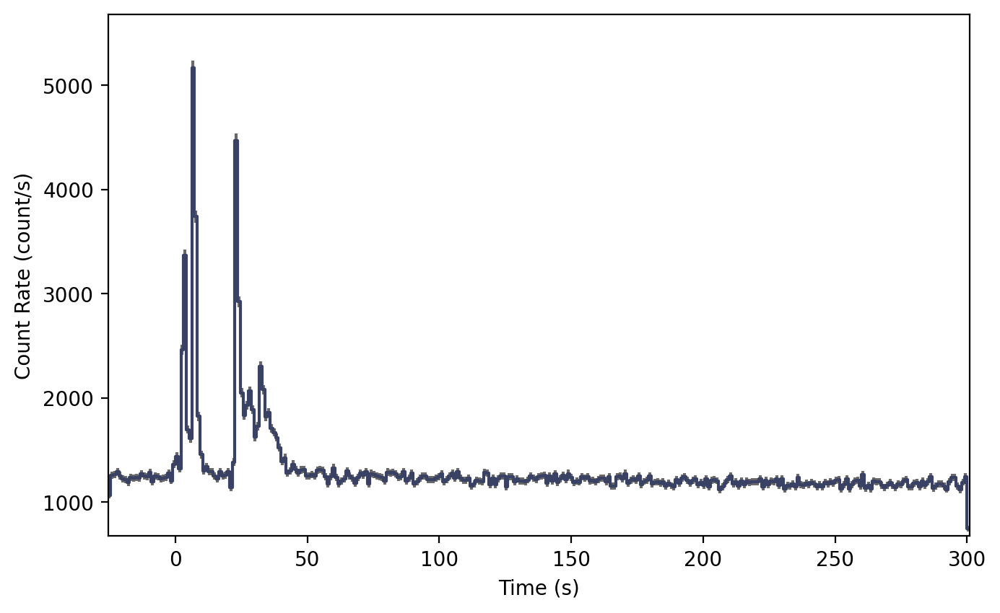
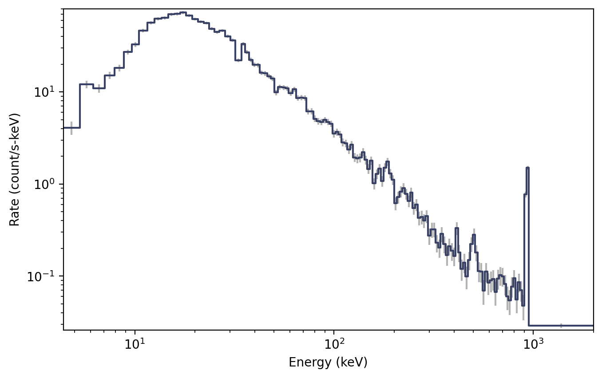
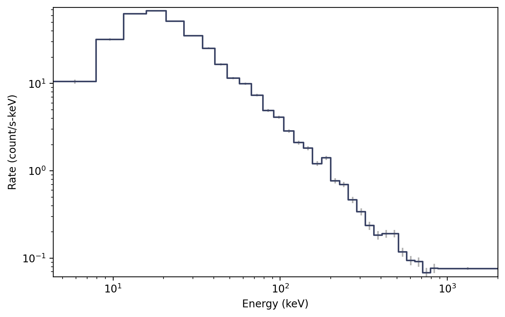

.. _gbm-tte:
.. |GbmTte| replace:: :class:`~gdt.missions.fermi.gbm.tte.GbmTte`
.. |EventList| replace:: :class:`~gdt.core.data_primitives.EventList`
.. |PhotonList| replace:: :class:`~gdt.core.tte.PhotonList`
.. |bin_by_time| replace:: :func:`~gdt.core.binning.unbinned.bin_by_time`
.. |combine_by_factor| replace:: :func:`~gdt.core.binning.binned.combine_by_factor`
.. |GbmPhaii| replace:: :class:`~gdt.missions.fermi.gbm.phaii.GbmPhaii`
.. |Lightcurve| replace:: :class:`~gdt.core.plot.lightcurve.Lightcurve`
.. |Spectrum| replace:: :class:`~gdt.core.plot.spectrum.Spectrum`

******************************************************
Fermi GBM TTE Data (:mod:`gdt.missions.fermi.gbm.tte`)
******************************************************
TTE (Time-Tagged Event) data is basically a time-series of "counts" where each 
count is mapped to an energy channel. It is the temporally unbinned 
representation of CSPEC data (128 energy channels). We can read a TTE file with
the |GbmTte| class, much the same way we can read 
:ref:`Fermi GBM PHAII Data<gbm-phaii>`.

    >>> from gdt.core import data_path
    >>> from gdt.missions.fermi.gbm.tte import GbmTte
    >>> filepath = data_path.joinpath('fermi-gbm/glg_tte_n9_bn090131090_v01.fit')
    >>> tte = GbmTte.open(filepath)
    >>> tte
    <GbmTte: glg_tte_n9_bn090131090_v01.fit;
     trigger time: 255060563.149072;
     time range (-25.49109798669815, 300.73552399873734);
     energy range (4.3897294998168945, 2000.0)>

Since GBM uses the FITS format, the data files have multiple data extensions, 
each with metadata information in a header. There is also a primary header that 
contains metadata relevant to the overall file. You can access this metadata 
information:

    >>> tte.headers.keys()
    ['PRIMARY', 'EBOUNDS', 'EVENTS', 'GTI']
    
There is easy access for certain important properties of the data:

    >>> # the good time intervals for the data
    >>> tte.gti
    <Gti: 1 intervals; range (-25.49109798669815, 300.73552399873734)>
    
    >>> # the trigger time
    >>> tte.trigtime
    255060563.149072
    
    >>> # the time range
    >>> tte.time_range
    (-25.49109798669815, 300.73552399873734)
    
    >>> # the energy range
    >>> tte.energy_range
    (4.3897294998168945, 2000.0)
    
    >>> # number of energy channels
    >>> tte.num_chans
    128

We can retrieve the time-tagged events data contained within the file, which
is an |EventList| class (see 
:external:ref:`Event Data<core-data_primitives-event>` for more details).

    >>> tte.data
    <EventList: 422405 events;
     time range (-25.49109798669815, 300.73552399873734);
     channel range (0, 127)>

Through the |PhotonList| base class, there are a lot of high level functions 
available to us, such as slicing the data in time or energy:

    >>> time_sliced_tte = tte.slice_time((-10.0, 10.0))
    >>> time_sliced_tte
    <GbmTte: 
     trigger time: 255060563.149072;
     time range (-9.999035984277725, 9.998922020196915);
     energy range (4.3897294998168945, 2000.0)>

    >>> energy_sliced_tte = tte.slice_energy((50.0, 300.0))
    >>> energy_sliced_tte
    <GbmTte: 
     trigger time: 255060563.149072;
     time range (-25.48361200094223, 300.73552399873734);
     energy range (48.08032989501953, 304.6853332519531)>

Making a lightcurve using TTE data is slightly more complicated than it is for 
the pre-binned data because the TTE is temporally unbinned. So first the data 
has to be binned, and then it can be displayed. Here, we want to bin unbinned 
data, so we choose from the 
:external:ref:`Binning Algorithms for Unbinned Data<binning_unbinned>`. For
this example, let's choose |bin_by_time|, which simply bins the TTE to the
prescribed time resolution.  Then we can use our chosen binning algorithm to
**convert** the TTE to a PHAII object

    >>> from gdt.core.binning.unbinned import bin_by_time
    >>> phaii = tte.to_phaii(bin_by_time, 1.024, time_ref=0.0)
    >>> phaii
    <GbmPhaii: 
     trigger time: 255060563.149072;
     time range (-25.6, 301.056);
     energy range (4.3897294998168945, 2000.0)>

Here, we binned the data to 1.024 s resolution, and reference point at which
to start the binning (in both directions) was at T0=0 s.  Now that it is 
a |GbmPhaii| object, we can do all of the same operations that we could with
CTIME or CSPEC data.  For example, we can plot the lightcurve using the 
|Lightcurve| class:

    >>> import matplotlib.pyplot as plt
    >>> from gdt.core.plot.lightcurve import Lightcurve
    >>> lcplot = Lightcurve(data=phaii.to_lightcurve())
    >>> plt.show()
    

One thing to note, if we want to temporally rebin the data, we could certainly 
rebin the PHAII object, but in order to leverage the full power and flexibility 
of TTE, it would be good to (re)bin the TTE data instead to create a new PHAII
object.

To plot the spectrum, we don't have to worry about binning the data, since the 
TTE is already necessarily pre-binned in energy. So we can make a spectrum plot 
directly from the TTE object without any extra steps using the |Spectrum| 
class:

    >>> from gdt.core.plot.spectrum import Spectrum
    >>> # integrate over time from 0 - 10 s
    >>> spectrum = tte.to_spectrum(time_range=(0.0, 10.0))
    >>> specplot = Spectrum(data=spectrum)
    >>> plt.show() 

Perhaps the spectral resolution is a little bit higher than we need (i.e. if 
studying a weak source). We can rebin the count spectrum, but remember that the 
energy is pre-binned, so we need to use one of the 
:external:ref:`Binning Algorithms for Binned Data<binning_binned>`. Here, we 
will use |combine_by_factor|, which simply combines bins together by an integer 
factor:

    >>> from gdt.core.binning.binned import combine_by_factor
    >>> # rebin the count spectrum by a factor of 4
    >>> rebinned_energy = tte.rebin_energy(combine_by_factor, 4)
    >>> rebinned_spectrum = rebinned_energy.to_spectrum(time_range=(0.0, 10.0))
    >>> specplot = Spectrum(data=rebinned_spectrum)
    >>> plt.show()    

See :external:ref:`Plotting Lightcurves<plot-lightcurve>` and 
:external:ref:`Plotting Count Spectra<plot-spectrum>` for more on how to modify 
these plots.

Finally, we can write out a new fully-qualified GBM TTE FITS file after some 
reduction tasks.  For example, we can write out our time-sliced data object:

    >>> time_sliced_tte.write('./', filename='my_first_custom_tte.fit')
    
For more details about working with TTE data, see 
:external:ref:`Photon List and Time-Tagged Event Files<core-tte>`.

    
Reference/API
=============

.. automodapi:: gdt.missions.fermi.gbm.tte
   :inherited-members:

