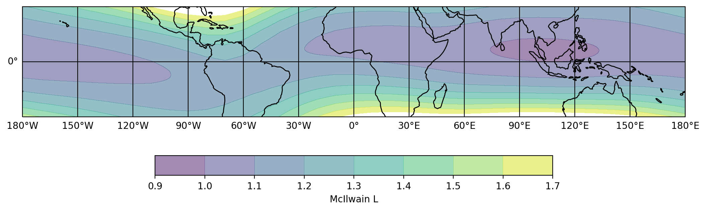
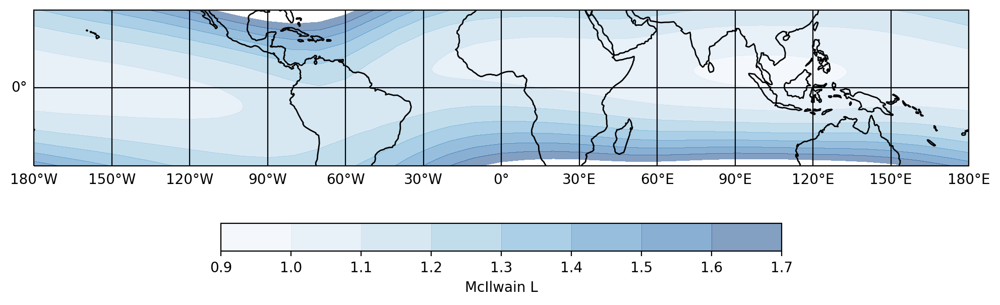
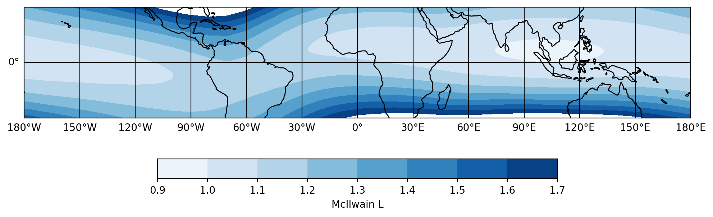
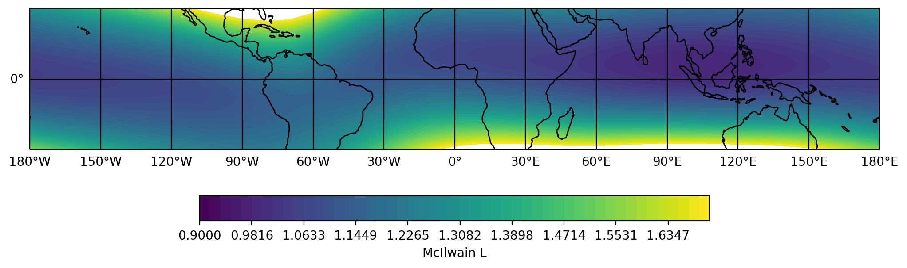
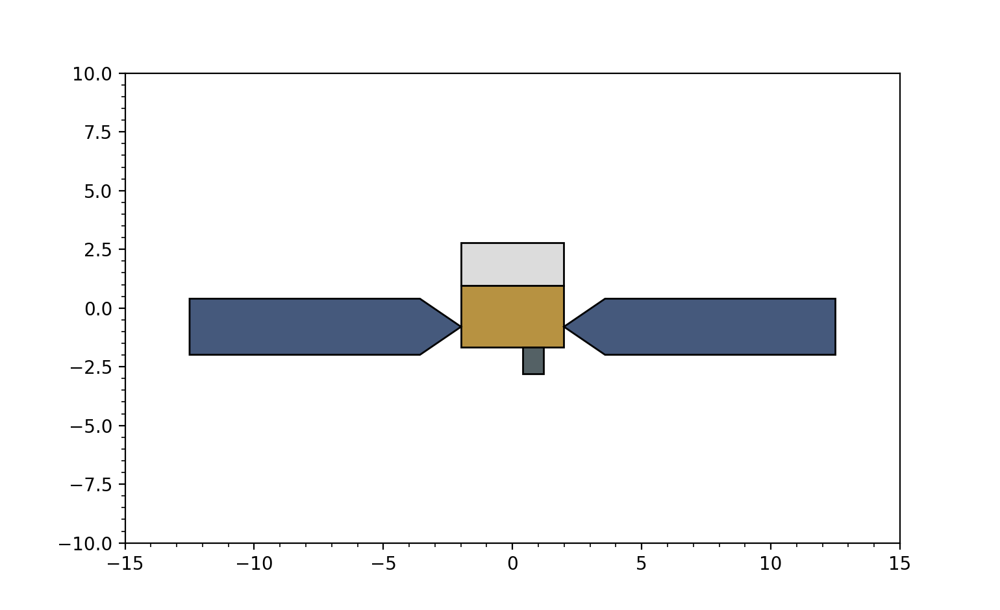
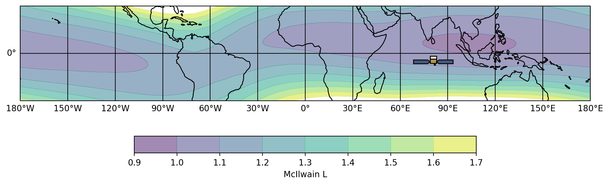

.. _fermi-plot:
.. |McIlwainL| replace:: :class:`~gdt.missions.fermi.plot.McIlwainL`
.. |FermiEarthPlot| replace:: :class:`~gdt.missions.fermi.plot.FermiEarthPlot`
.. |FermiIcon| replace:: :class:`~gdt.missions.fermi.plot.FermiIcon`
.. |EarthPlot| replace:: :class:`~gdt.plot.earthplot.EarthPlot`
.. |GdtCmap| replace:: :class:`~gdt.plot.plot.GdtCmap`

***************************
Fermi-specific Plot Classes
***************************

There are a few Fermi-specific plot classes that extend the functionality of  
those provided in :ref:`The Plot Package`.  These classes primarily augment
the orbital plotting for Fermi, with a plot class for managing the McIlwain L
heat map (|McIlwainL|), a plot class for implementing this seamlessly into an
orbital plot (|FermiEarthplot|), and a class defining a custom Fermi plot icon
(|FermiIcon|).

We can initialize the |FermiEarthPlot| by calling it in the same way as the 
base |EarthPlot| class:

    >>> import matplotlib.pyplot as plt
    >>> earthplot = FermiEarthPlot(interactive=True)
    >>> plt.show()

Here we see the region of the Fermi orbit and a heatmap of the McIlwain L 
parameter overlaid.  The heatmap object can be retrieved:

    >>> earthplot.mcilwainl
    <McIlwainL: color='viridis';
                alpha=0.5;
                num_contours=9;
                colorbar=True>

We can change the color map via the |GdtCmap| object:

    >>> earthplot.mcilwainl.color.name = 'Blues'
    

And we can also increase the alpha of the heatmap:

    >>> earthplot.mcilwainl.alpha=1.0

We can also change the number of contours, but to do so, we must initialize
a new |McIlwainL| plot object and specify the contours on initialization:

    >>> import numpy as np
    >>> # don't create mcilwain heatmap, we will do this manually
    >>> earthplot = FermiEarthPlot(interactive=True, mcilwain=False)
    >>> # 50 contour levels
    >>> levels = np.linspace(0.9, 1.7, 50)
    >>> # add our custom McIlwainL object
    >>> mcl = McIlwainL((-30.0, 30.0), (-180.0, 180.0), earthplot.geoaxes, alpha=1.0,
    >>>                 levels=levels)
    >>> plot.show()

   
   

The |FermiIcon| is a custom plot marker in the shape of Fermi.  Although 
typically used as a plot marker in |FermiEarthPlot|, we can view it up close:

    >>> from gdt.plot.plot import GdtPlot
    >>> plot = GdtPlot()
    >>> icon = FermiIcon(0.0, 0.0, plot.ax)
    >>> plot.xlim = (-15.0, 15.0)
    >>> plot.ylim = (-10.0, 10.0)
    >>> plt.show()
    

We can add the |FermiIcon| to the |FermiEarthPlot| by giving it the East
longitude and latitude of the position and the plot axes:

    >>> earthplot = FermiEarthPlot(interactive=True)
    >>> # East longitude 80.88, latitude -4.62
    >>> icon = FermiIcon(80.88, -4.62, earthplot.geoaxes)
    >>> plt.show()

Reference/API
=============

.. automodapi:: gdt.missions.fermi.plot
   :inherited-members:

